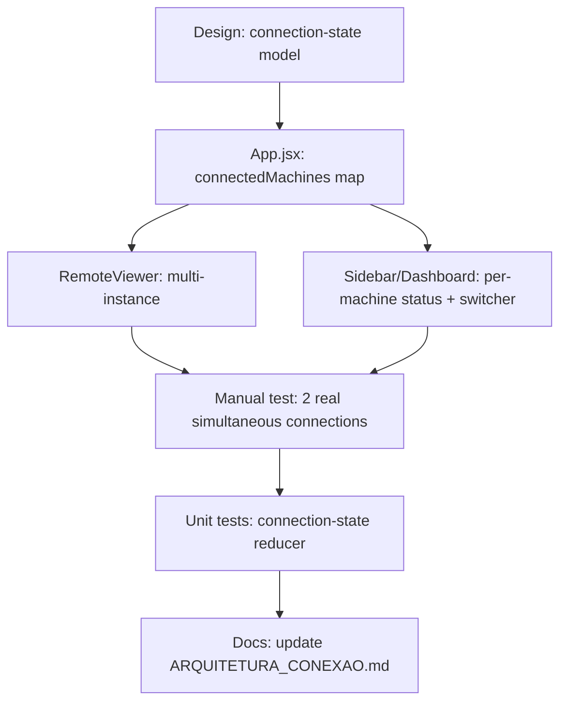
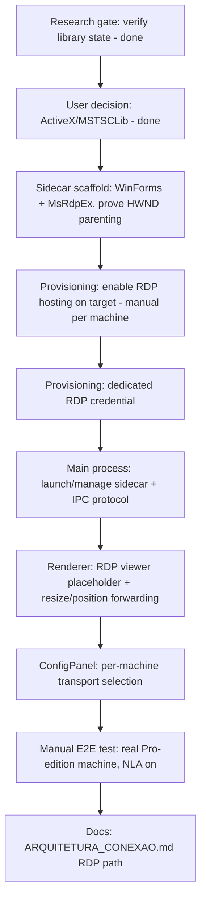
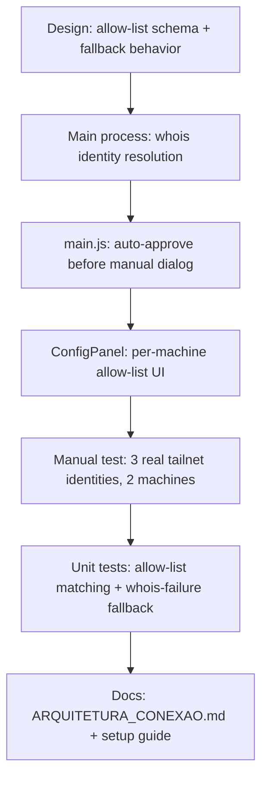
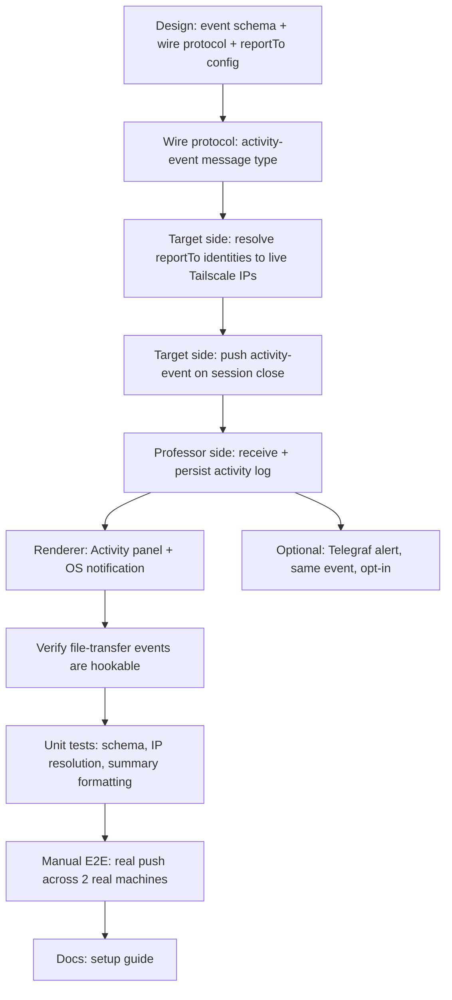

# GOALS — Multi-PC Remote Control Overhaul

**Goal type:** Feature (bounded new capability added to an app that already works — see
`~/.claude/base_project/references/goal-types/feature.md`). Not a `fix`: the current
single-active-connection model and the TightVNC dependency are working-as-designed
characteristics, not reproducible bugs.

## Context (read before touching either section)

The request that produced this file: replace TightVNC-based remote control with Windows'
own native remote-control capability, driven by two beliefs — (1) TightVNC requires a
unique email per machine, (2) the app is "broken" because it only supports one connected
PC at a time. Research done before writing this plan corrected both:

- **TightVNC does not require an email** for the free/GPL server this project already
  uses — only TightVNC's _commercial_ license (which this project doesn't use) asks for
  an email, for paid support contact. The real, already-documented pain point (see
  `docs/ARQUITETURA_CONEXAO.md`, "Problema 3") is that TightVNC runs unintegrated: its own
  UI, its own password, no control from the app.
- **The "one PC at a time" limit is a UI/state decision, not a transport limit.**
  `src/main/connection/proxy.js`'s `wss.on('connection', ...)` already handles each
  WebSocket→TCP bridge independently — nothing there prevents two simultaneous bridges to
  two different hosts. The actual constraint is `activeMachineId` (singular) in
  `src/renderer/src/App.jsx`, and `connectMachine` explicitly disconnecting the current
  machine before connecting a new one.
- **Windows' native Remote Desktop (RDP) can only _host_ incoming connections on
  Pro/Enterprise/Education** — Home edition can connect out but never accept connections
  in. Confirmed with the user: all 10 target machines are Pro/Enterprise/Education, so
  this is not a blocker here.
- **Embedding RDP the way noVNC is embedded today is possible but not risk-free.** The
  only real embeddable-in-Electron JS RDP client (`node-rdpjs` / `mstsc.js`, both by
  `citronneur`) only implements the SSL security layer — **no NLA (Network Level
  Authentication) support**. Modern Windows defaults to requiring NLA, so this path
  requires _disabling_ NLA on every target machine, a real (if narrow, since Tailscale
  already gates network access) security downgrade. Both libraries also show little
  recent maintenance activity — re-verify before depending on them (see GOALS 2, item 1).

Given this, the plan below has two independent parts. **GOALS 1 ships regardless of how
GOALS 2 turns out** — it fixes the concretely-true pain point (only one PC connected at a
time) using the transport that already works everywhere (VNC), with no new external
dependency and no security tradeoff. **GOALS 2 is the RDP integration the user actually
asked for**, scoped so it can be adopted machine-by-machine instead of a hard cutover,
with the NLA tradeoff surfaced explicitly rather than decided silently.

---

## GOALS 1 — Multi-Session Support (VNC, guaranteed path)

Removes the single-active-connection limitation from the existing, already-working VNC
transport. No new dependency, works on every target machine regardless of Windows
edition. Ships first because it's the concrete, low-risk fix for the pain point that's
actually real.



- [x] **Design rationale**: replace the single `activeMachineId` (`src/renderer/src/App.jsx:42`)
      with a `connectedMachines` map keyed by machine id (`{ status, ftSessionId, vncState,
... }` per entry), plus a separate `focusedMachineId` for which one is currently visible.
      Switching focus does **not** disconnect the others. Explicitly out of scope for this
      item: simultaneous multi-monitor tiling (side-by-side live views) — only one focused
      view at a time, others stay connected in the background, switchable via tabs. Done
      when: this model is written down (a short note in `docs/ARQUITETURA_CONEXAO.md` is
      enough) before any state code changes.
- [x] **Implementation — connection state**: rewrite `App.jsx`'s machine-connection state
      around `connectedMachines`/`focusedMachineId` per the design above.
      `connectMachine(machine)` adds an entry instead of disconnecting the current one first;
      `disconnectMachine(id)` now takes an explicit id instead of always acting on "the"
      active machine. Update every call site (`Sidebar.jsx:82`, `Dashboard.jsx:35`,
      `RemoteViewer.jsx:93`, `FileExplorer.jsx:52`) to pass the specific machine id. Done
      when: two machines can be connected at once without either being torn down, verified by
      reading `connectedMachines` state in React DevTools mid-session.
- [x] **Implementation — RemoteViewer**: support one mounted `RemoteViewer` instance per
      connected machine (not one shared instance re-pointed at whichever machine is active).
      Only the focused instance renders visibly; backgrounded instances stay mounted (don't
      unmount the iframe — that would drop the VNC session) but are hidden (e.g. `display:
none`), matching how browsers keep background tabs alive. Done when: switching focus
      between two connected machines is instant (no VNC reconnect/handshake), verified
      manually.
- [x] **Implementation — file transfer session per machine**: `ftSessionId` currently
      lives as single state in `App.jsx`; it needs to become per-machine like the rest of
      `connectedMachines`, since `FileExplorer.jsx` reads `machineCtx.ftSessionId` for "the"
      remote pane. Decide (and note in the design item above) whether the File Explorer
      follows the _focused_ machine only, or needs its own machine picker — recommended:
      follows focused machine, simplest and matches current single-file-explorer-panel UI.
- [x] **Implementation — Sidebar/Dashboard UI**: show per-machine connection status
      (connected/connecting/disconnected) independent of which one is focused; clicking a
      connected-but-unfocused machine switches focus instead of reconnecting. Add a way to
      disconnect one specific machine without affecting the others.
- [ ] **Verification — proxy.js**: no server-side code change expected (each
      `wss.on('connection', ...)` bridge is already independent), but confirm this by
      actually running two concurrent WS→TCP bridges to two different Tailscale hosts and
      watching `src/main/connection/proxy.js`'s logs for both — this is a `(manual)` check,
      not something a unit test can prove for a real network path.
- [x] **Tests**: unit test the new connection-state transitions in isolation (connect A;
      connect B without disconnecting A; confirm both present; disconnect A; confirm B
      unaffected) — pure state logic, testable with Vitest the same way
      `src/main/connection/__tests__/net-guard.test.js` already covers `isAllowedHost`. Done
      when: a test exists that fails against the old single-`activeMachineId` shape and
      passes against the new one.
- [x] **Docs**: update `docs/ARQUITETURA_CONEXAO.md` — the "Sessão: Apenas UM usuário
      remoto por vez" line (§2 and the §7 comparison table) no longer describes this app once
      this section ships; replace with the actual new behavior.

**Done when (feature-level):** a user can connect to PC A, connect to PC B without PC A
dropping, switch focus between them instantly, and disconnect either independently — used
the way a user would use it, not just present in the diff.

---

## GOALS 2 — RDP-Based Remote Control (new transport, opt-in per machine)

Adds Windows' native Remote Desktop as an alternative transport to VNC, embedded in the
app the same way noVNC is today (per the user's explicit preference over an external
`mstsc.exe` window). Selectable **per machine** in `ConfigPanel` rather than a hard
cutover — VNC keeps working for any machine not yet migrated.

**Revised after re-running the research gate (2026-09-14):** `citronneur/node-rdpjs`
(last commit 2017) and `citronneur/mstsc.js` (last commit 2021) are both confirmed dead —
worse than "little recent activity," genuinely abandoned. The community
"node-rdpjs-2" fork is dead too (2020) and never added NLA. A third option surfaced
during this check — MeshCentral (actively maintained) vendors an NLA-patched node-rdpjs
fork — but it's GPL-3.0, which conflicts with this project's MIT license
(`docs/LICENSE.txt`) if distributed, so it was **not** adopted.

**Decided path (user's explicit choice, given all three above): native Windows RDP
ActiveX control (`MSTSCLib`, via `mstscax.dll`, already present on every target
Windows machine).** This sidesteps the NLA tradeoff entirely instead of accepting it —
`MSTSCLib` is Microsoft's own client (the same control `mstsc.exe` itself embeds) and
already speaks NLA natively, so **no registry change, no security downgrade, and no
GPL code** are needed on any target machine. The tradeoff moves from "security" to
"build complexity": Electron/Chromium cannot host an ActiveX/COM control inside its own
renderer, so this needs a small **native Windows sidecar process** (C#/.NET Framework
4.8 WinForms — chosen over modern .NET so no new SDK install is required; this machine
already has MSBuild + .NET Framework reference assemblies via VS Build Tools) that
hosts the control in its own native window, parented under the Electron window's HWND
(`BrowserWindow.getNativeWindowHandle()` + Win32 `SetParent`) so it visually sits inside
the app like noVNC's iframe does. Interop uses
[`Devolutions/MsRdpEx`](https://github.com/Devolutions/MsRdpEx) (MIT, actively
maintained, built exactly for this) rather than hand-rolling `aximp`/`tlbimp` COM
interop generation.

**Also simplifies the transport plan:** unlike VNC/noVNC (browser code, can only reach
the network via `proxy.js`'s WS→TCP bridge), the sidecar is a native process that opens
its own raw TCP connection to port 3389 — **no `proxy.js` changes needed**. The existing
connect-request/approval flow (`connection-request.js`) still gates whether a connection
is allowed at all, same as VNC and file transfer today.



- [x] **Research gate (do this first, it can invalidate the rest of this section)**:
      re-checked `citronneur/node-rdpjs`, `citronneur/mstsc.js`, and the `node-rdpjs-2`
      fork against their live repos (commit dates, issues) — all three confirmed
      abandoned, not just "little recent activity." Also found and evaluated MeshCentral's
      maintained-but-GPL-3.0 fork as a fourth data point. Done when: checked against live
      repos, not assumed from this file — done, see revision note above.
- [x] **Design rationale — transport decision `(manual)`**: presented the research above
      plus 4 concrete paths (native ActiveX, accept SSL-only/no-NLA, vendor the GPL-3.0
      MeshCentral fork, external `mstsc.exe` window) to the user. **Decided: native
      ActiveX/MSTSCLib**, sidestepping the NLA tradeoff rather than accepting it, at the
      cost of a new native-sidecar build target (see revision note above for the concrete
      architecture). Done when: written down before implementation — done, this section.
- [x] **Sidecar scaffold**: new `sidecar/` folder — minimal C#/.NET Framework 4.8
      WinForms project (`OpenPortalRdpSidecar.csproj` + `Program.cs`), built via the
      already-installed MSBuild (classic non-SDK-style `.csproj`, since this machine's VS
      Build Tools has no `Microsoft.NET.Sdk` resolver — required installing the .NET
      Framework 4.8 Developer Pack, which needed a pending Windows Update to actually
      finish installing first before the reboot it wanted would take). `MsRdpEx` not yet
      wired in — this milestone only proves the embedding mechanism, not the RDP control.
      Verified (2026-09-16), programmatically rather than by eye — screen access to the
      dev Electron window wasn't available this session, so used `EnumChildWindows` +
      `GetWindowThreadProcessId` from PowerShell to confirm directly with the OS: the
      sidecar's WinForms window is a real Win32 child of the running
      `BrowserWindow`'s HWND, visible, and positioned correctly inside its client area
      (requested rect (250,150,500,350) landed at screen (258,181)-(758,531), i.e.
      parent-relative as expected — border/titlebar chrome accounts for the small offset).
      Fixed a real bug found along the way: positioning right after `SetParent` landed the
      window at Windows' (-32000,-32000) "minimized" park position, because the `WS_MINIMIZE`
      style bit and the stale WinForms-level `Location` (screen coords, wrong once the
      window is truly `WS_CHILD`) fought each other — fix was `ShowWindow(SW_SHOWNORMAL)`
      before `SetWindowPos`, using `SetWindowPos` (parent-relative) instead of
      `form.Location` after reparenting. A `WS_CHILD` window automatically moves with its
      parent for free (no code needed) — live resize propagation (parent resizes → overlay
      resizes) is intentionally deferred to the "main process sidecar management + IPC"
      item below, not part of this narrower proof.
- [ ] **Provisioning — enable RDP hosting `(manual, one-time per machine)`**: add an
      "Enable Remote Desktop hosting" action to the target-side app (the same "OpenPortal
      Remote" instance that already runs on each of the 10 PCs), triggered from its own
      settings UI, running elevated (UAC prompt expected — cannot be silent):
  ```powershell
  Set-ItemProperty -Path 'HKLM:\System\CurrentControlSet\Control\Terminal Server' -Name 'fDenyTSConnections' -Value 0
  Enable-NetFirewallRule -DisplayGroup "Remote Desktop"
  ```
  No `UserAuthentication`/NLA registry change — NLA stays on (that's the whole point of
  this path). Verify success by reading the registry value back, not just trusting a zero
  exit code. **Implemented (2026-09-16)**: `src/main/system/rdp-provisioning.js`
  (`enableRdpHosting`, elevated via `Start-Process -Verb RunAs` with a base64
  `-EncodedCommand` to sidestep quoting hell, verified by reading `fDenyTSConnections`
  back rather than trusting the exit code) + a button in ConfigPanel's new "Hospedagem
  RDP nesta máquina" section. Unit-tested with an injectable `spawn` (never shells out in
  tests). Still open: the actual "Done when" — a live UAC-approved run on a real
  Pro-edition machine — needs a real machine and a human clicking "Aceitar" on the UAC
  prompt, neither available in this session.
- [ ] **Provisioning — dedicated RDP credential**: create a dedicated local Windows
      account for the app's own RDP use during provisioning (strong random password,
      generated once, stored via Electron's `safeStorage` — not the target user's personal
      Windows login). Recommended over reusing the logged-in user's own password so the admin
      never needs to know or handle it. Done when: the app can authenticate an RDP session
      using only this generated account, with no manual credential entry per connection.
      **Implemented (2026-09-16)**: `generatePassword`/`createRdpCredential` in
      `rdp-provisioning.js` (`New-LocalUser` + `Add-LocalGroupMember` on "Remote Desktop
      Users", elevated the same way as hosting above), plus a "Criar conta dedicada" UI in
      ConfigPanel that shows the generated password once (never persisted by this app —
      it's meant to be copied into the connecting side's own `rdpPassword` field, encrypted
      there via `safeStorage` same as the VNC password). Still open: can't verify real RDP
      auth against this account yet — that needs both a live machine and the MsRdpEx
      integration below.
- [x] **Implementation — main process sidecar management + IPC**: `rdp-sidecar.js`
      (spawn/pipe-client management, Map-by-machine-id like `file-transfer-session.js`) +
      `rdp-protocol.js` (pure command builders/encoder) + a matching named-pipe server
      added to `sidecar/Program.cs`. Credentials travel only over the pipe, never argv —
      only the pipe name (a random, non-secret identifier) and the initial rect are passed
      as process arguments. Verified end-to-end (2026-09-16) against the real running dev
      Electron window: spawned the sidecar, connected the pipe, sent a `resize` command
      (window moved live) and a `connect` command (stub — no MsRdpEx yet, just proved the
      round trip), then a clean `disconnect`. Found and fixed a real bug along the way:
      `NamedPipeServerStream` (C#) takes the bare pipe name, but `net.createConnection`
      (Node) needs the full `\\.\pipe\<name>` path — mixing the two up made every
      connection attempt fail with ENOENT despite both sides being otherwise correct.
      Now wired end to end (2026-09-16): `App.jsx`'s `connectMachine`/`disconnectMachine`
      branch on `resolveTransport(machine)` (new pure helper in `connectionState.js`,
      tested) — RDP machines skip `vnc:connect`/`vnc:disconnect` and instead let
      `RdpViewer` drive `rdp:start`/`rdp:resize`/`rdp:setVisible`/`rdp:stop` (new IPC
      handlers in `ipc-handlers.js`, using `mainWindow.getNativeWindowHandle()` to get the
      real parent HWND instead of the manual-test hardcoded value used during the
      standalone proof). Added a `visibility` pipe command (`buildVisibilityCommand` +
      `sidecar/Program.cs` `ShowWindow(SW_HIDE/SW_SHOWNORMAL)`) that didn't exist in the
      standalone proof — needed because the native window isn't a DOM child, so
      `display:none` on its host `<div>` (GOALS 1's focus-switching) doesn't hide it; the
      main process now hides/reshows it explicitly on focus change. No `proxy.js` change
      needed (confirmed — see revision note above).
- [x] **Implementation — renderer RDP viewer**: new module mirroring
      `src/renderer/src/modules/connection/RemoteViewer.jsx`'s shape and lifecycle (same
      connection banner, same mount/unmount behavior per GOALS 1's multi-instance model),
      but rendering a positioned placeholder `<div>` (the sidecar's native window overlays
      it) instead of a `<canvas>` or iframe. Reuse GOALS 1's per-machine connection-state
      model rather than adding a second, parallel state shape for RDP-mode machines.
      **Done (2026-09-16)**: `RdpViewer.jsx` — starts the sidecar on mount from its
      container's real `getBoundingClientRect()` (scaled by `devicePixelRatio` to convert
      DOM logical pixels to the physical pixels `SetWindowPos` expects), forwards resize
      via the same `ResizeObserver` pattern `RemoteViewer` already uses, stops the sidecar
      on unmount/disconnect. Rendered from the same `connectedMachines` map as
      `RemoteViewer` (`App.jsx`), chosen via `resolveTransport` — no second state shape.
- [x] **Implementation — ConfigPanel transport selection**: per-machine setting (VNC vs
      RDP) in `src/renderer/src/modules/config/ConfigPanel.jsx`, defaulting existing machines
      to VNC (no forced migration). Done when: a machine's transport can be switched without
      affecting any other machine's configuration. **Done (2026-09-16)**: a VNC/RDP toggle
      per machine in the existing per-machine draft array (each machine's `transport` field
      is independent, same save/validate path as the rest of the machine form); RDP mode
      swaps the VNC password field for username/password/port fields
      (`rdpUsername`/`rdpPassword`/`rdpPort`, `rdpPassword` encrypted at rest the same way
      as the VNC password — see `config-manager.js`).
- [x] **Tests**: unit-test the transport-selection logic and the main-process IPC message
      shapes (connect/disconnect/resize) — pure logic, no real sidecar process needed. Full
      RDP behavior (auth, rendering, input forwarding, HWND parenting itself) is **not**
      realistically unit-testable — mark end-to-end verification `(manual)`: connect to a
      real Pro-edition Tailscale-networked machine with RDP hosting enabled and NLA still
      on, confirm mouse, keyboard, and screen updates all work, then confirm the same
      machine still works if switched back to VNC. **Done (2026-09-16)**:
      `resolveTransport` (transport-selection logic, extracted to be testable rather than
      left as an inline literal check) in `connectionState.test.js`; IPC message shapes
      (connect/resize/disconnect/visibility) in `rdp-protocol.test.js`; provisioning script
      builders + elevated-run/verify flow (with an injectable `spawn`, no real shell-out)
      in `rdp-provisioning.test.js`. 59/59 tests passing. The manual E2E item below remains
      the real behavioral proof — these tests only cover the logic around it.
- [x] **Docs**: update `docs/ARQUITETURA_CONEXAO.md` with the RDP path — the sidecar
      architecture, why NLA needed no tradeoff this time, the provisioning steps, and
      per-machine migration guidance (nothing forces a machine off VNC). **Done
      (2026-09-16)**: new "RDP nativo (transporte alternativo ao VNC)" subsection under
      §2, covering the sidecar/HWND-reparenting rationale, the named-pipe command set
      (including `visibility`, added this round), why `proxy.js` doesn't need to change,
      the two provisioning steps, and an explicit "current state" note that MsRdpEx/
      MSTSCLib is still a stub, so migrating a machine today proves the plumbing, not a
      working RDP session yet.

**Done when (feature-level):** a Pro-edition machine configured for RDP connects, shows
its live screen embedded in the app next to the file explorer exactly like VNC does
today, and accepts mouse/keyboard input — used the way the user would use it, not just
present in source. VNC-configured machines are entirely unaffected.

---

## GOALS 3 — Multi-User Access Control (identity-based auto-authorization)

Added after a follow-up conversation: this project is moving from "one admin's own
machines" to a classroom/lab model — a professor (P) with access to every machine, and
students (e.g. E1, E2) each scoped to specific machines only (E1 → m1; E2 → m2, m3).
Today, every incoming connection request shows a manual accept/reject dialog on the
target machine (`handleConnectionRequest` in `src/main/main.js:37`) — that assumes a
human is physically present to click it, which doesn't hold for an unattended lab
machine. This section replaces "always ask a human" with "auto-approve a verified,
allow-listed identity; fall back to the existing manual dialog for anyone else" — nothing
is removed for the existing single-admin use case, since an admin's own ad-hoc requests
just keep hitting the manual dialog as they do today.

**Identity, decided in conversation before this file was written:** verify the requester
through Tailscale's own device/user identity (`tailscale whois`) rather than inventing a
token or keypair system. Confirmed viable: Tailscale's free Personal plan supports up to
6 separate user accounts in one tailnet (each person needs their own login — a shared
login defeats this entirely), and `tailscale whois --json <ip>` (or the equivalent
LocalAPI `/localapi/v0/whois?addr=`) returns an authenticated `UserProfile.LoginName`
(email) for the peer at that Tailscale IP — this is what gets checked against each
machine's local allow-list, never the self-reported `fromName` the wire protocol already
carries (that stays display-only, e.g. in the approval dialog's message, never used for
the authorization decision).



- [x] **Design rationale**: each target machine's `config.json` (via
      `src/main/config/config-manager.js`) gets a new `allowedUsers: string[]` field — the
      list of Tailscale login emails auto-approved on that specific machine. This is separate
      from the existing `machines` array (which is "who I want to connect to," client-side);
      `allowedUsers` is "who's allowed to connect to _me_," and only matters on the receiving
      side. Explicitly out of scope for this item: any UI for _managing_ the allow-lists of
      all 4 machines from one place (that's the "registro central" idea already flagged as a
      future step in `docs/ARQUITETURA_CONEXAO.md` §5) — for now each machine's list is edited
      locally on that machine, matching how VNC passwords already work per-machine. Done
      when: the schema and the "unlisted identity falls back to manual dialog, never
      auto-rejects" behavior are written down before any code changes.
- [x] **Implementation — identity resolution**: new module (e.g.
      `src/main/connection/identity.js`) that shells out to
      `tailscale.exe whois --json <ip>` (locate the binary the same defensive way
      `net-guard.js`'s Tailscale-IP checks already assume Tailscale is installed; if the
      binary isn't found or the call fails for any reason, resolve to "unknown" rather than
      throwing — this must never crash or block the connection-request flow) and extracts
      `UserProfile.LoginName`. Done when: calling this against a real Tailscale peer IP on
      this dev machine returns the correct email, and calling it against a non-Tailscale IP
      (or with Tailscale stopped) returns "unknown" without throwing.
- [x] **Implementation — auto-approval gate**: in `handleConnectionRequest`
      (`src/main/main.js:37`), resolve identity via the module above _before_ building the
      `dialog.showMessageBox` call; if the resolved login is in `allowedUsers`, call
      `finish(true)` immediately and skip the dialog entirely; otherwise fall through to
      today's manual dialog unchanged. Log the auto-approval decision (identity + machine +
      timestamp) the same way other main-process events already log to
      `src/main/logging.js` — this log is also GOALS 4's event source, see below. Done when:
      a listed identity connects with zero dialog shown, and an unlisted identity still sees
      today's exact dialog.
- [x] **Implementation — allow-list UI**: new section in
      `src/renderer/src/modules/config/ConfigPanel.jsx` (this machine's own settings, not the
      remote-machines list) to add/remove allowed Tailscale login emails, persisted via the
      existing `readConfig`/`writeConfig` IPC round-trip. Done when: adding an email here and
      restarting the request flow (no app restart needed, config is read live per request)
      actually changes whether that identity is auto-approved.
- [x] **Tests**: unit-test the allow-list matching logic and the whois-failure fallback
      path in isolation (mock the `tailscale whois` shell-out) — same Vitest pattern as
      `src/main/connection/__tests__/net-guard.test.js`. Done when: a test proves an
      allow-listed login auto-approves, a non-listed login does not, and a whois failure
      degrades to "not allow-listed" (manual dialog) rather than crashing or auto-approving.
- [ ] **Verification `(manual)`**: with 3 real, separately-logged-in Tailscale identities
      (matching the P/E1/E2 shape) and 2 machines, confirm: the professor's identity
      auto-approves on both; a student's identity auto-approves only on their assigned
      machine and still shows the manual dialog on the other.
- [x] **Docs**: update `docs/ARQUITETURA_CONEXAO.md` with the new auto-authorization flow
      (§2's approval description no longer says "aprovação manual obrigatória" unconditionally),
      and add a short setup note: every person needing auto-approval must be invited to the
      tailnet with their **own** Tailscale account (shared logins break identity resolution
      — `whois` would return the same login for everyone sharing it).

**Done when (feature-level):** the professor connects to any of the 4 machines without
being asked to approve; each student connects only to their assigned machine(s) without
being asked; anyone not on a machine's list still gets today's manual dialog. VNC- and
RDP-mode machines (GOALS 1/2) both go through this same gate, since it lives in the
connection-request layer both share.

---

## GOALS 4 — Session Activity Panel (push) & Optional Telegram Alerts

Depends on GOALS 3 (needs a resolved, trustworthy identity to say _who_ did something,
not just an IP). Scope for this section is deliberately narrower than the original ask:
**session-level events only** — who connected, when, for how long, how many files moved.
**Explicitly out of scope**: per-application usage monitoring (e.g. "used VS Code") and
post-disconnect idle/lock-state tracking ("left the machine on unattended") — both are
real endpoint-monitoring features with their own privacy and implementation weight (process
polling or foreground-window hooks), not a natural extension of what this app already
observes. Revisit as its own feature if session-level logging turns out to be insufficient.

**Revised after conversation**: the original version of this section made Telegram the
only delivery surface. Reconsidered — routing student session data through a third-party
chat app isn't the "professional" surface the user actually wants, and it's not this
project's only sensible option. **Primary surface is now an in-app Activity panel** in
the professor's own OpenPortal Remote installation (this app is already Electron+React —
that's a more fitting home for institutional session data than a chat app). Telegram
becomes an **optional, opt-in push alert** layered on top, not the delivery mechanism
itself. Delivery model is **push, in real time** (chosen over pull deliberately, knowing
it's more work): each target machine reports its own session events to the professor's
app _as they happen_, rather than the professor's app fetching on demand.

**Push design, reusing existing infrastructure rather than adding a new server:** every
installation of this app already runs `ConnectionRequestServer`
(`src/main/connection/connection-request.js`), listening on the signal port (18902) for
`{ type: 'connect-request', ... }` messages — including the professor's own installation,
which is just as much a "server" as any target machine today. Activity push reuses this
exact same always-listening port with a new message type
(`{ type: 'activity-event', ... }`) instead of standing up a second server anywhere.



- [x] **Design rationale**: event schema —
      `{ identity, machineName, startedAt, endedAt, durationMs, filesTransferred }`
      (`identity` from GOALS 3's verified `tailscale whois` resolution, never the
      self-reported `fromName`). Each target machine gets a new config field
      `reportTo: string[]` — Tailscale login emails to push activity events to (for the
      classroom example: every target machine's `reportTo` includes the professor's login).
      At push time, resolve each `reportTo` login to its _current_ Tailscale IP via
      `tailscale status --json` (a peer's IP is stable per-device but this avoids hardcoding
      it, and naturally supports the professor checking from a different device later) and
      send the `activity-event` message to that IP's signal port. If a `reportTo` identity
      isn't currently reachable (device offline), drop that push silently — this is a
      best-effort real-time notice, not a guaranteed-delivery log; the session itself still
      happened and isn't lost, only the _live_ notice is. Done when: this schema, the
      `reportTo` config shape, and the best-effort (not guaranteed) delivery guarantee are
      written down before implementation.
- [x] **Implementation — wire protocol**: extend
      `src/main/connection/connection-request.js`'s `dataHandler` to recognize
      `{ type: 'activity-event', ... }` alongside the existing `{ type: 'connect-request' }`
      handling — routed to a new `onActivityEvent` callback (mirroring the existing
      `onRequest` callback pattern) rather than overloading the connection-approval path.
      This message is fire-and-forget (no approval dialog, no response expected) — done when:
      sending a hand-crafted `activity-event` message to a running instance's signal port is
      received and dispatched without disturbing any in-progress `connect-request` handling
      on the same port.
- [x] **Implementation — target-side push**: on `'file-session-close'` (already emitted
      by `ConnectionRequestServer`, paired with `'file-session-open'` by `requestId` to
      compute `durationMs`), for each configured `reportTo` identity: resolve its live
      Tailscale IP (`tailscale status --json`, matching by `UserProfile.LoginName`) and send
      the `activity-event` message to that IP's signal port. Reuses GOALS 3's identity module
      for the `whois`/`status` shell-outs rather than duplicating Tailscale CLI handling.
- [x] **Verify file-transfer counting**: check whether
      `src/main/file-transfer/file-agent.js` (target-side handler) exposes a hookable event
      or count for completed downloads specifically — this was assumed easy in conversation
      but not yet confirmed against the actual code; if no such hook exists yet, add one
      (count frames/operations of the download type) rather than re-deriving it after the
      fact. Done when: a real file download during a session shows up in the count reported
      at session-end.
- [x] **Implementation — professor-side receive + persist**: in `src/main/main.js`,
      handle incoming `activity-event` messages by appending to a new local activity log
      (new module, e.g. `src/main/config/activity-log.js`, following the exact
      read/write/trim pattern `history-manager.js` already uses — same `userData`-relative
      JSON file approach, no new storage technology), and firing an Electron `Notification`
      (already used elsewhere in this codebase, see `src/main/core/ipc-handlers.js`) for the
      real-time-push feel. Expose the log to the renderer via IPC, same request/response
      pattern as `getHistory`/`addHistoryEntry` already use.
- [x] **Implementation — Activity panel (renderer)**: new module under
      `src/renderer/src/modules/` (e.g. `activity/ActivityPanel.jsx`), reachable from
      `Sidebar.jsx` like the existing Dashboard/Config/Files sections. Shows the activity log
      as a live-updating feed — a monospace/terminal-styled dark feed is a reasonable default
      given the user's own framing of "professional" for this panel, but the exact visual
      treatment is an implementation-time call, not something this plan needs to pin down.
      Done when: an `activity-event` arriving while the panel is open appends to the visible
      feed without a manual refresh (same live-IPC-push pattern the app already uses for VNC
      status via `onVncStatus`).
- [x] **Implementation — optional Telegram alert (opt-in)**: add `telegraf` (recommended
      over `node-telegram-bot-api` — that one's active development has slowed — and
      preferred over `grammy` here since Telegraf is the more established default for a
      simple send-only bot with no need for its full middleware/session system) as a
      dependency, but gated behind an explicit per-machine toggle (default **off**) in
      `ConfigPanel.jsx` — this is a supplementary phone alert, not the delivery mechanism.
      When enabled, the same `'file-session-close'` event that drives the in-app push also
      formats and sends: `"{identity} conectou-se a {machineName} das {startedAt} às
{endedAt} ({duration}). Arquivos transferidos: {filesTransferred}."` Send failures (bad
      token, network down) log and continue — never let a Telegram failure affect the actual
      remote-control session or the in-app log, which stays the source of truth regardless.
- [x] **Implementation — config UI**: `reportTo` list and the Telegram opt-in
      (token/chat-id, encrypted via `safeStorage` like the existing VNC password field) live
      together in this machine's own settings, near GOALS 3's allow-list section — both are
      "what this machine reports, and to whom/how."
- [x] **Tests**: unit-test the event schema, the `reportTo`→live-IP resolution (mock the
      `tailscale status --json` shell-out), and the Telegram summary-message formatting —
      pure logic, same Vitest pattern as the rest of this project. Mock any Telegraf send
      call and any real network send in tests; never hit real Tailscale/Telegram from the
      test suite.
- [ ] **Verification `(manual)`**: with 2 real machines over a real Tailscale network,
      configure one target's `reportTo` to point at the professor's identity, run a real
      session (connect, transfer a file, disconnect), and confirm the Activity panel updates
      live on the professor's side with correct identity/duration/file-count — then
      separately enable the Telegram opt-in and confirm the same event also produces a
      Telegram message.
- [x] **Docs**: update `docs/ARQUITETURA_CONEXAO.md` with the push architecture and
      `reportTo` config, plus a short setup guide (can live there or in a new
      `docs/TELEGRAM_SETUP.md`) for the optional Telegram bot — creating it via @BotFather,
      getting its token, finding the destination chat id.

**Done when (feature-level):** every session on every machine with a configured
`reportTo` — regardless of whether it was auto-approved (GOALS 3) or manually approved —
appears in the professor's in-app Activity panel in real time with accurate identity,
duration, and file-transfer count; Telegram, where opted in, delivers the same summary as
a phone alert. A machine with no `reportTo` configured behaves exactly as it does today —
this is additive, not a forced-on data-collection default.

---

## Ordering across all four sections

GOALS 1 and GOALS 2 (transport: multi-session VNC, then optional RDP) are independent of
GOALS 3 and GOALS 4 (access control and monitoring) — different layers of the app, no
shared code path forces an order between the two pairs. Within each pair: GOALS 1 before
GOALS 2 as already explained above; **GOALS 3 before GOALS 4**, since GOALS 4's event log
needs GOALS 3's verified-identity resolution to say who did something, not just which IP.
A reasonable sequencing if doing all four: GOALS 1 → GOALS 3 → GOALS 4 → GOALS 2. GOALS
1, 3, and the core of 4 (in-app panel, push over the existing signal port) all have zero
new external dependencies — only GOALS 4's optional Telegram opt-in and all of GOALS 2
carry real external-dependency risk (Telegram bot uptime, the RDP libraries' maintenance
state), so this ordering clears the low-risk wins first. GOALS 3/4 could just as easily
run before or interleaved with GOALS 1/2 if the classroom rollout is more urgent than the
RDP migration.
