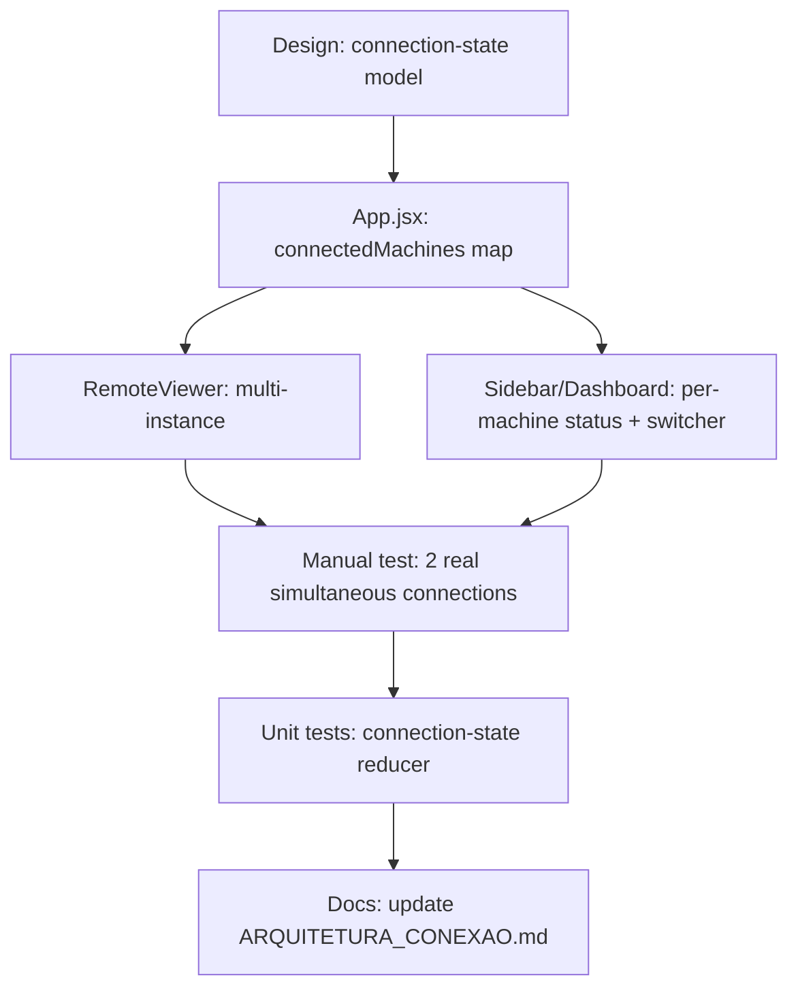
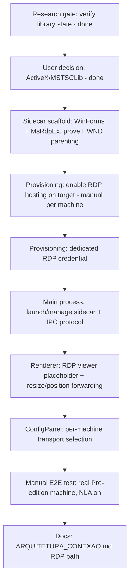
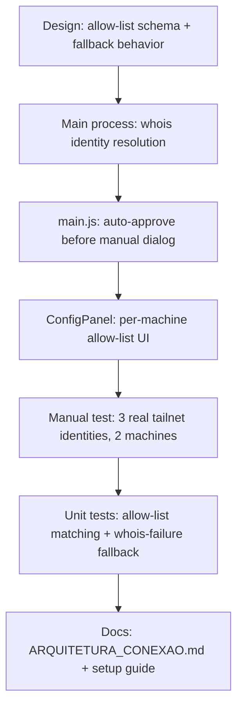
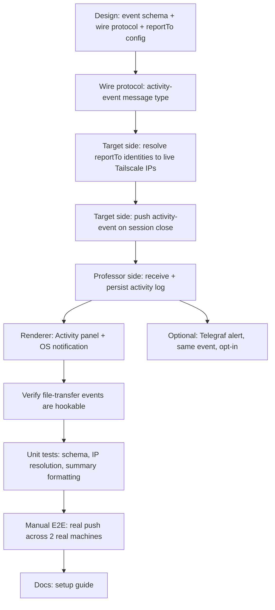
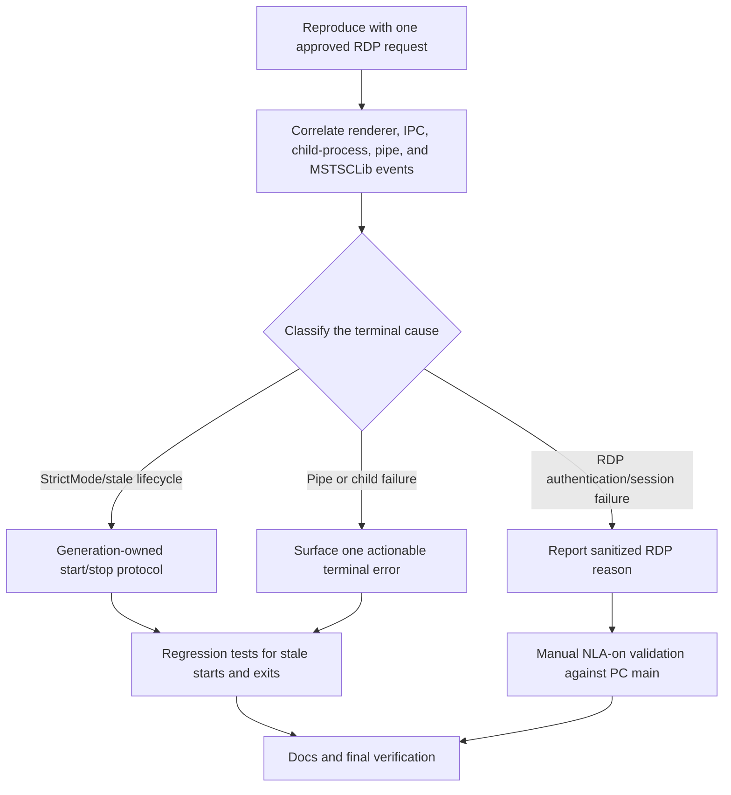
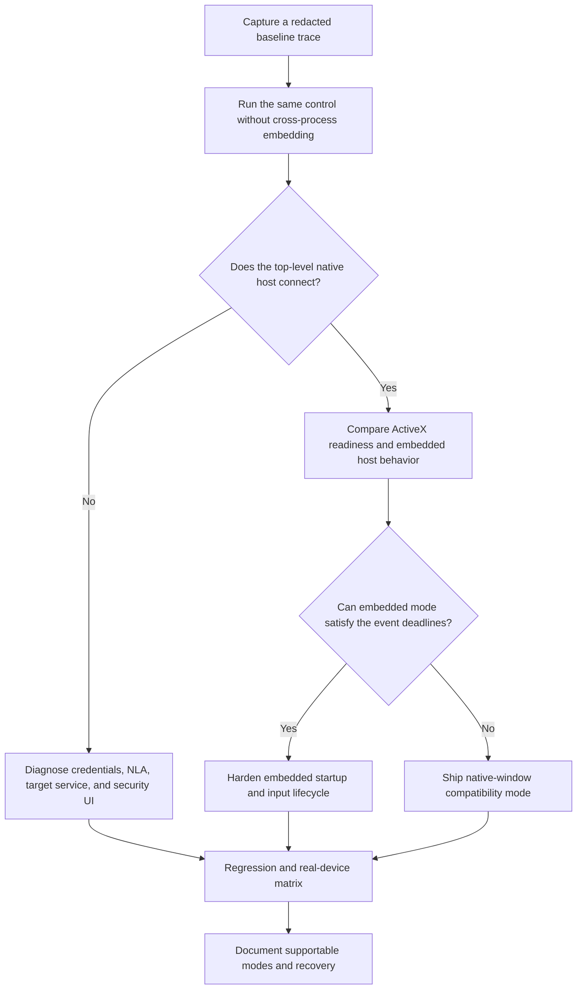
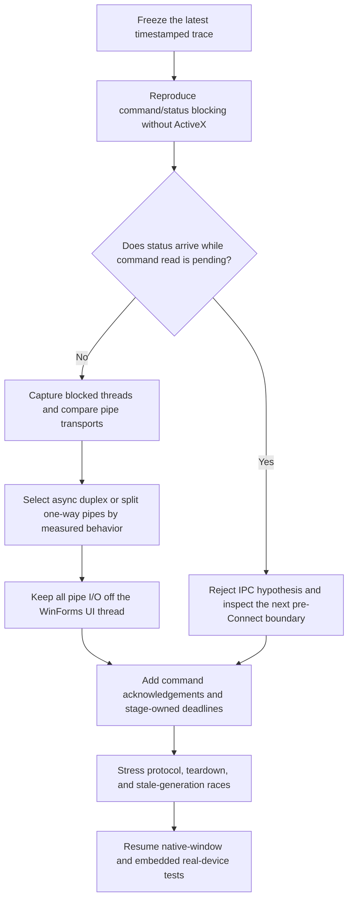
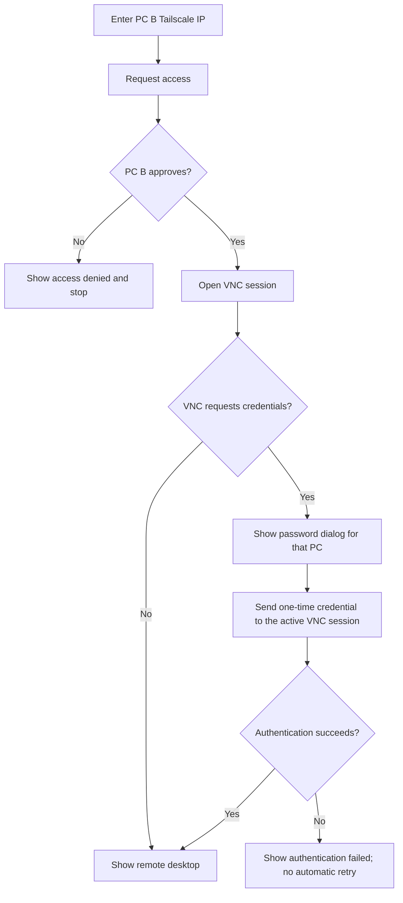
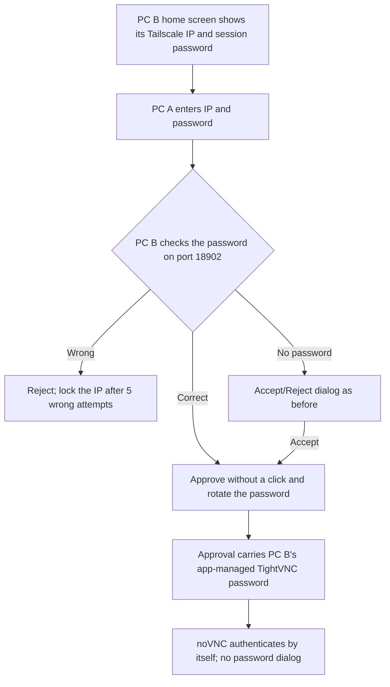

# GOALS — Multi-PC Remote Control Overhaul

**Goal type:** Feature (bounded new capability added to an app that already works — see
`~/.claude/base_project/references/goal-types/feature.md`). Not a `fix`: the current
single-active-connection model and the TightVNC dependency are working-as-designed
characteristics, not reproducible bugs.

## Context (read before touching either section)

The request that produced this file: replace TightVNC-based remote control with Windows'
own native remote-control capability, driven by two beliefs — (1) TightVNC requires a
unique email per machine, (2) the app is "broken" because it only supports one connected
PC at a time. Research done before writing this plan corrected both:

- **TightVNC does not require an email** for the free/GPL server this project already
  uses — only TightVNC's _commercial_ license (which this project doesn't use) asks for
  an email, for paid support contact. The real, already-documented pain point (see
  `docs/ARQUITETURA_CONEXAO.md`, "Problema 3") is that TightVNC runs unintegrated: its own
  UI, its own password, no control from the app.
- **The "one PC at a time" limit is a UI/state decision, not a transport limit.**
  `src/main/connection/proxy.js`'s `wss.on('connection', ...)` already handles each
  WebSocket→TCP bridge independently — nothing there prevents two simultaneous bridges to
  two different hosts. The actual constraint is `activeMachineId` (singular) in
  `src/renderer/src/App.jsx`, and `connectMachine` explicitly disconnecting the current
  machine before connecting a new one.
- **Windows' native Remote Desktop (RDP) can only _host_ incoming connections on
  Pro/Enterprise/Education** — Home edition can connect out but never accept connections
  in. Confirmed with the user: all 10 target machines are Pro/Enterprise/Education, so
  this is not a blocker here.
- **Embedding RDP the way noVNC is embedded today is possible but not risk-free.** The
  only real embeddable-in-Electron JS RDP client (`node-rdpjs` / `mstsc.js`, both by
  `citronneur`) only implements the SSL security layer — **no NLA (Network Level
  Authentication) support**. Modern Windows defaults to requiring NLA, so this path
  requires _disabling_ NLA on every target machine, a real (if narrow, since Tailscale
  already gates network access) security downgrade. Both libraries also show little
  recent maintenance activity — re-verify before depending on them (see GOALS 2, item 1).

Given this, the plan below has two independent parts. **GOALS 1 ships regardless of how
GOALS 2 turns out** — it fixes the concretely-true pain point (only one PC connected at a
time) using the transport that already works everywhere (VNC), with no new external
dependency and no security tradeoff. **GOALS 2 is the RDP integration the user actually
asked for**, scoped so it can be adopted machine-by-machine instead of a hard cutover,
with the NLA tradeoff surfaced explicitly rather than decided silently.

---

## GOALS 1 — Multi-Session Support (VNC, guaranteed path)

Removes the single-active-connection limitation from the existing, already-working VNC
transport. No new dependency, works on every target machine regardless of Windows
edition. Ships first because it's the concrete, low-risk fix for the pain point that's
actually real.



- [x] **Design rationale**: replace the single `activeMachineId` (`src/renderer/src/App.jsx:42`)
      with a `connectedMachines` map keyed by machine id (`{ status, ftSessionId, vncState,
... }` per entry), plus a separate `focusedMachineId` for which one is currently visible.
      Switching focus does **not** disconnect the others. Explicitly out of scope for this
      item: simultaneous multi-monitor tiling (side-by-side live views) — only one focused
      view at a time, others stay connected in the background, switchable via tabs. Done
      when: this model is written down (a short note in `docs/ARQUITETURA_CONEXAO.md` is
      enough) before any state code changes.
- [x] **Implementation — connection state**: rewrite `App.jsx`'s machine-connection state
      around `connectedMachines`/`focusedMachineId` per the design above.
      `connectMachine(machine)` adds an entry instead of disconnecting the current one first;
      `disconnectMachine(id)` now takes an explicit id instead of always acting on "the"
      active machine. Update every call site (`Sidebar.jsx:82`, `Dashboard.jsx:35`,
      `RemoteViewer.jsx:93`, `FileExplorer.jsx:52`) to pass the specific machine id. Done
      when: two machines can be connected at once without either being torn down, verified by
      reading `connectedMachines` state in React DevTools mid-session.
- [x] **Implementation — RemoteViewer**: support one mounted `RemoteViewer` instance per
      connected machine (not one shared instance re-pointed at whichever machine is active).
      Only the focused instance renders visibly; backgrounded instances stay mounted (don't
      unmount the iframe — that would drop the VNC session) but are hidden (e.g. `display:
none`), matching how browsers keep background tabs alive. Done when: switching focus
      between two connected machines is instant (no VNC reconnect/handshake), verified
      manually.
- [x] **Implementation — file transfer session per machine**: `ftSessionId` currently
      lives as single state in `App.jsx`; it needs to become per-machine like the rest of
      `connectedMachines`, since `FileExplorer.jsx` reads `machineCtx.ftSessionId` for "the"
      remote pane. Decide (and note in the design item above) whether the File Explorer
      follows the _focused_ machine only, or needs its own machine picker — recommended:
      follows focused machine, simplest and matches current single-file-explorer-panel UI.
- [x] **Implementation — Sidebar/Dashboard UI**: show per-machine connection status
      (connected/connecting/disconnected) independent of which one is focused; clicking a
      connected-but-unfocused machine switches focus instead of reconnecting. Add a way to
      disconnect one specific machine without affecting the others.
- [ ] **Verification — proxy.js**: no server-side code change expected (each
      `wss.on('connection', ...)` bridge is already independent), but confirm this by
      actually running two concurrent WS→TCP bridges to two different Tailscale hosts and
      watching `src/main/connection/proxy.js`'s logs for both — this is a `(manual)` check,
      not something a unit test can prove for a real network path. **Partially automated
      (2026-09-16)**: added `proxy.test.js`, an integration test that starts the real
      `startWebSocketProxy` against two local fake TCP targets and two concurrent WS
      clients, proving the two bridges don't cross-talk and that closing one leaves the
      other unaffected (exactly the code-level property this item cares about — each
      bridge's `tcpSocket`/heartbeat state lives entirely in its own connection closure).
      What's still open and genuinely `(manual)`: this only proves the code is
      connection-independent, not that it works across a real Tailscale link to two
      distinct physical machines — that's a network-reachability question, not a
      code-correctness one, and still needs the real 2-machine test.
- [x] **Tests**: unit test the new connection-state transitions in isolation (connect A;
      connect B without disconnecting A; confirm both present; disconnect A; confirm B
      unaffected) — pure state logic, testable with Vitest the same way
      `src/main/connection/__tests__/net-guard.test.js` already covers `isAllowedHost`. Done
      when: a test exists that fails against the old single-`activeMachineId` shape and
      passes against the new one.
- [x] **Docs**: update `docs/ARQUITETURA_CONEXAO.md` — the "Sessão: Apenas UM usuário
      remoto por vez" line (§2 and the §7 comparison table) no longer describes this app once
      this section ships; replace with the actual new behavior.

**Done when (feature-level):** a user can connect to PC A, connect to PC B without PC A
dropping, switch focus between them instantly, and disconnect either independently — used
the way a user would use it, not just present in the diff.

---

## GOALS 2 — RDP-Based Remote Control (new transport, opt-in per machine)

Adds Windows' native Remote Desktop as an alternative transport to VNC, embedded in the
app the same way noVNC is today (per the user's explicit preference over an external
`mstsc.exe` window). Selectable **per machine** in `ConfigPanel` rather than a hard
cutover — VNC keeps working for any machine not yet migrated.

**Revised after re-running the research gate (2026-09-14):** `citronneur/node-rdpjs`
(last commit 2017) and `citronneur/mstsc.js` (last commit 2021) are both confirmed dead —
worse than "little recent activity," genuinely abandoned. The community
"node-rdpjs-2" fork is dead too (2020) and never added NLA. A third option surfaced
during this check — MeshCentral (actively maintained) vendors an NLA-patched node-rdpjs
fork — but it's GPL-3.0, which conflicts with this project's MIT license
(`docs/LICENSE.txt`) if distributed, so it was **not** adopted.

**Decided path (user's explicit choice, given all three above): native Windows RDP
ActiveX control (`MSTSCLib`, via `mstscax.dll`, already present on every target
Windows machine).** This sidesteps the NLA tradeoff entirely instead of accepting it —
`MSTSCLib` is Microsoft's own client (the same control `mstsc.exe` itself embeds) and
already speaks NLA natively, so **no registry change, no security downgrade, and no
GPL code** are needed on any target machine. The tradeoff moves from "security" to
"build complexity": Electron/Chromium cannot host an ActiveX/COM control inside its own
renderer, so this needs a small **native Windows sidecar process** (C#/.NET Framework
4.8 WinForms — chosen over modern .NET so no new SDK install is required; this machine
already has MSBuild + .NET Framework reference assemblies via VS Build Tools) that
hosts the control in its own native window, parented under the Electron window's HWND
(`BrowserWindow.getNativeWindowHandle()` + Win32 `SetParent`) so it visually sits inside
the app like noVNC's iframe does. Interop uses
[`Devolutions/MsRdpEx`](https://github.com/Devolutions/MsRdpEx) (MIT, actively
maintained, built exactly for this) rather than hand-rolling `aximp`/`tlbimp` COM
interop generation.

**Also simplifies the transport plan:** unlike VNC/noVNC (browser code, can only reach
the network via `proxy.js`'s WS→TCP bridge), the sidecar is a native process that opens
its own raw TCP connection to port 3389 — **no `proxy.js` changes needed**. The existing
connect-request/approval flow (`connection-request.js`) still gates whether a connection
is allowed at all, same as VNC and file transfer today.



- [x] **Research gate (do this first, it can invalidate the rest of this section)**:
      re-checked `citronneur/node-rdpjs`, `citronneur/mstsc.js`, and the `node-rdpjs-2`
      fork against their live repos (commit dates, issues) — all three confirmed
      abandoned, not just "little recent activity." Also found and evaluated MeshCentral's
      maintained-but-GPL-3.0 fork as a fourth data point. Done when: checked against live
      repos, not assumed from this file — done, see revision note above.
- [x] **Design rationale — transport decision `(manual)`**: presented the research above
      plus 4 concrete paths (native ActiveX, accept SSL-only/no-NLA, vendor the GPL-3.0
      MeshCentral fork, external `mstsc.exe` window) to the user. **Decided: native
      ActiveX/MSTSCLib**, sidestepping the NLA tradeoff rather than accepting it, at the
      cost of a new native-sidecar build target (see revision note above for the concrete
      architecture). Done when: written down before implementation — done, this section.
- [x] **Sidecar scaffold**: new `sidecar/` folder — minimal C#/.NET Framework 4.8
      WinForms project (`OpenPortalRdpSidecar.csproj` + `Program.cs`), built via the
      already-installed MSBuild (classic non-SDK-style `.csproj`, since this machine's VS
      Build Tools has no `Microsoft.NET.Sdk` resolver — required installing the .NET
      Framework 4.8 Developer Pack, which needed a pending Windows Update to actually
      finish installing first before the reboot it wanted would take). `MsRdpEx` wired in
      as a separate item below — this milestone only proved the embedding mechanism, not
      the RDP control itself.
      Verified (2026-09-16), programmatically rather than by eye — screen access to the
      dev Electron window wasn't available this session, so used `EnumChildWindows` +
      `GetWindowThreadProcessId` from PowerShell to confirm directly with the OS: the
      sidecar's WinForms window is a real Win32 child of the running
      `BrowserWindow`'s HWND, visible, and positioned correctly inside its client area
      (requested rect (250,150,500,350) landed at screen (258,181)-(758,531), i.e.
      parent-relative as expected — border/titlebar chrome accounts for the small offset).
      Fixed a real bug found along the way: positioning right after `SetParent` landed the
      window at Windows' (-32000,-32000) "minimized" park position, because the `WS_MINIMIZE`
      style bit and the stale WinForms-level `Location` (screen coords, wrong once the
      window is truly `WS_CHILD`) fought each other — fix was `ShowWindow(SW_SHOWNORMAL)`
      before `SetWindowPos`, using `SetWindowPos` (parent-relative) instead of
      `form.Location` after reparenting. A `WS_CHILD` window automatically moves with its
      parent for free (no code needed) — live resize propagation (parent resizes → overlay
      resizes) is intentionally deferred to the "main process sidecar management + IPC"
      item below, not part of this narrower proof.
- [x] **MsRdpEx/MSTSCLib integration**: real RDP client wired into
      `sidecar/Program.cs`, replacing the earlier text-label stub. Done when: the `connect`
      pipe command actually attempts a real RDP session (not just updates a label), NLA
      stays on, and resize keeps working via the same rect the sidecar already receives.
      **Done (2026-09-16)**: added `<PackageReference Include="Devolutions.MsRdpEx" />`
      to the classic (non-SDK-style) `.csproj` and confirmed `msbuild /t:restore` works
      for `PackageReference` even without the SDK-style project format — VS Build Tools
      ships its own NuGet restore targets, so no new tooling install was needed. Uses the
      package's default "Legacy" COM-interop mode, which is exactly the pre-built
      `Interop.MSTSCLib.dll`/`AxInterop.MSTSCLib.dll` that `aximp`/`tlbimp` would generate
      by hand from `mstscax.dll` — this is the whole reason MsRdpEx was chosen over
      hand-rolling that step (see design rationale above). `SidecarForm` now hosts an
      `AxMsRdpClient11NotSafeForScripting` control (confirmed via reflection against the
      restored assembly rather than guessed from memory — `AxMsRdpClient11...` is the
      newest client version the package ships) with `Server`/`UserName`/`ColorDepth` set
      directly, `AdvancedSettings2.RDPPort`/`ClearTextPassword`/`SmartSizing` and
      `AdvancedSettings7.EnableCredSspSupport = true` (NLA) set via explicit interface
      casts (the Ax wrapper's `AdvancedSettings2`/`AdvancedSettings7` properties are
      declared as the base/6 interfaces respectively — a known quirk of the generated
      wrapper, confirmed by inspecting the actual interop assembly, not assumed).
      `SmartSizing` means `resize` only needs `SetWindowPos` on the container (already
      implemented) — no per-resize resolution renegotiation. `OnConnecting`/`OnDisconnected`
      /`OnFatalError`/`OnLogonError` drive the status label (hidden once actually
      connected). Smoke-tested (2026-09-16) via a real pipe round-trip against
      `127.0.0.1:3389` with bogus credentials (loopback only, no real target or real
      credentials involved) — `Connect()` executes without crashing the sidecar,
      `resize`/`disconnect` still work mid-attempt, process exits cleanly. This proves the
      wiring end-to-end; it does **not** prove a real authenticated session, which needs
      an actual Pro-edition machine with RDP hosting enabled (see manual verification
      item below).
- [ ] **Provisioning — enable RDP hosting `(manual, one-time per machine)`**: add an
      "Enable Remote Desktop hosting" action to the target-side app (the same "OpenPortal
      Remote" instance that already runs on each of the 10 PCs), triggered from its own
      settings UI, running elevated (UAC prompt expected — cannot be silent):
  ```powershell
  Set-ItemProperty -Path 'HKLM:\System\CurrentControlSet\Control\Terminal Server' -Name 'fDenyTSConnections' -Value 0
  Enable-NetFirewallRule -DisplayGroup "Remote Desktop"
  ```
  No `UserAuthentication`/NLA registry change — NLA stays on (that's the whole point of
  this path). Verify success by reading the registry value back, not just trusting a zero
  exit code. **Implemented (2026-09-16)**: `src/main/system/rdp-provisioning.js`
  (`enableRdpHosting`, elevated via `Start-Process -Verb RunAs` with a base64
  `-EncodedCommand` to sidestep quoting hell, verified by reading `fDenyTSConnections`
  back rather than trusting the exit code) + a button in ConfigPanel's new "Hospedagem
  RDP nesta máquina" section. Unit-tested with an injectable `spawn` (never shells out in
  tests). Still open: the actual "Done when" — a live UAC-approved run on a real
  Pro-edition machine — needs a real machine and a human clicking "Aceitar" on the UAC
  prompt, neither available in this session.
- [ ] **Provisioning — dedicated RDP credential**: create a dedicated local Windows
      account for the app's own RDP use during provisioning (strong random password,
      generated once, stored via Electron's `safeStorage` — not the target user's personal
      Windows login). Recommended over reusing the logged-in user's own password so the admin
      never needs to know or handle it. Done when: the app can authenticate an RDP session
      using only this generated account, with no manual credential entry per connection.
      **Implemented (2026-09-16)**: `generatePassword`/`createRdpCredential` in
      `rdp-provisioning.js` (`New-LocalUser` + `Add-LocalGroupMember` on "Remote Desktop
      Users", elevated the same way as hosting above), plus a "Criar conta dedicada" UI in
      ConfigPanel that shows the generated password once (never persisted by this app —
      it's meant to be copied into the connecting side's own `rdpPassword` field, encrypted
      there via `safeStorage` same as the VNC password). Still open: can't verify real RDP
      auth against this account yet — MsRdpEx is now wired in (see item above), so the
      only remaining gap is a live Pro-edition machine to actually test against.
- [x] **Implementation — main process sidecar management + IPC**: `rdp-sidecar.js`
      (spawn/pipe-client management, Map-by-machine-id like `file-transfer-session.js`) +
      `rdp-protocol.js` (pure command builders/encoder) + a matching named-pipe server
      added to `sidecar/Program.cs`. Credentials travel only over the pipe, never argv —
      only the pipe name (a random, non-secret identifier) and the initial rect are passed
      as process arguments. Verified end-to-end (2026-09-16) against the real running dev
      Electron window: spawned the sidecar, connected the pipe, sent a `resize` command
      (window moved live) and a `connect` command (stub — no MsRdpEx yet, just proved the
      round trip), then a clean `disconnect`. Found and fixed a real bug along the way:
      `NamedPipeServerStream` (C#) takes the bare pipe name, but `net.createConnection`
      (Node) needs the full `\\.\pipe\<name>` path — mixing the two up made every
      connection attempt fail with ENOENT despite both sides being otherwise correct.
      Now wired end to end (2026-09-16): `App.jsx`'s `connectMachine`/`disconnectMachine`
      branch on `resolveTransport(machine)` (new pure helper in `connectionState.js`,
      tested) — RDP machines skip `vnc:connect`/`vnc:disconnect` and instead let
      `RdpViewer` drive `rdp:start`/`rdp:resize`/`rdp:setVisible`/`rdp:stop` (new IPC
      handlers in `ipc-handlers.js`, using `mainWindow.getNativeWindowHandle()` to get the
      real parent HWND instead of the manual-test hardcoded value used during the
      standalone proof). Added a `visibility` pipe command (`buildVisibilityCommand` +
      `sidecar/Program.cs` `ShowWindow(SW_HIDE/SW_SHOWNORMAL)`) that didn't exist in the
      standalone proof — needed because the native window isn't a DOM child, so
      `display:none` on its host `<div>` (GOALS 1's focus-switching) doesn't hide it; the
      main process now hides/reshows it explicitly on focus change. No `proxy.js` change
      needed (confirmed — see revision note above).
- [x] **Implementation — renderer RDP viewer**: new module mirroring
      `src/renderer/src/modules/connection/RemoteViewer.jsx`'s shape and lifecycle (same
      connection banner, same mount/unmount behavior per GOALS 1's multi-instance model),
      but rendering a positioned placeholder `<div>` (the sidecar's native window overlays
      it) instead of a `<canvas>` or iframe. Reuse GOALS 1's per-machine connection-state
      model rather than adding a second, parallel state shape for RDP-mode machines.
      **Done (2026-09-16)**: `RdpViewer.jsx` — starts the sidecar on mount from its
      container's real `getBoundingClientRect()` (scaled by `devicePixelRatio` to convert
      DOM logical pixels to the physical pixels `SetWindowPos` expects), forwards resize
      via the same `ResizeObserver` pattern `RemoteViewer` already uses, stops the sidecar
      on unmount/disconnect. Rendered from the same `connectedMachines` map as
      `RemoteViewer` (`App.jsx`), chosen via `resolveTransport` — no second state shape.
- [x] **Implementation — ConfigPanel transport selection**: per-machine setting (VNC vs
      RDP) in `src/renderer/src/modules/config/ConfigPanel.jsx`, defaulting existing machines
      to VNC (no forced migration). Done when: a machine's transport can be switched without
      affecting any other machine's configuration. **Done (2026-09-16)**: a VNC/RDP toggle
      per machine in the existing per-machine draft array (each machine's `transport` field
      is independent, same save/validate path as the rest of the machine form); RDP mode
      swaps the VNC password field for username/password/port fields
      (`rdpUsername`/`rdpPassword`/`rdpPort`, `rdpPassword` encrypted at rest the same way
      as the VNC password — see `config-manager.js`).
- [x] **Tests**: unit-test the transport-selection logic and the main-process IPC message
      shapes (connect/disconnect/resize) — pure logic, no real sidecar process needed. Full
      RDP behavior (auth, rendering, input forwarding, HWND parenting itself) is **not**
      realistically unit-testable — mark end-to-end verification `(manual)`: connect to a
      real Pro-edition Tailscale-networked machine with RDP hosting enabled and NLA still
      on, confirm mouse, keyboard, and screen updates all work, then confirm the same
      machine still works if switched back to VNC. **Done (2026-09-16)**:
      `resolveTransport` (transport-selection logic, extracted to be testable rather than
      left as an inline literal check) in `connectionState.test.js`; IPC message shapes
      (connect/resize/disconnect/visibility) in `rdp-protocol.test.js`; provisioning script
      builders + elevated-run/verify flow (with an injectable `spawn`, no real shell-out)
      in `rdp-provisioning.test.js`. 59/59 tests passing. The manual end-to-end
      verification described in this same item's own text above remains the real
      behavioral proof — these tests only cover the logic around it, and a loopback smoke
      test (127.0.0.1, bogus credentials, see the MsRdpEx integration item above) only
      proves the wiring doesn't crash on a real `Connect()` call, not a real session.
- [x] **Docs**: update `docs/ARQUITETURA_CONEXAO.md` with the RDP path — the sidecar
      architecture, why NLA needed no tradeoff this time, the provisioning steps, and
      per-machine migration guidance (nothing forces a machine off VNC). **Done
      (2026-09-16)**: new "RDP nativo (transporte alternativo ao VNC)" subsection under
      §2, covering the sidecar/HWND-reparenting rationale, the named-pipe command set
      (including `visibility`, added this round), why `proxy.js` doesn't need to change,
      the two provisioning steps, and an explicit "current state" note. **Updated again
      same day** once MsRdpEx was actually wired in: the note now says the real MSTSCLib
      control is integrated and smoke-tested (loopback), with only a live authenticated
      session against a real Pro-edition machine left unverified.

**Done when (feature-level):** a Pro-edition machine configured for RDP connects, shows
its live screen embedded in the app next to the file explorer exactly like VNC does
today, and accepts mouse/keyboard input — used the way the user would use it, not just
present in source. VNC-configured machines are entirely unaffected.

---

## GOALS 3 — Multi-User Access Control (identity-based auto-authorization)

Added after a follow-up conversation: this project is moving from "one admin's own
machines" to a classroom/lab model — a professor (P) with access to every machine, and
students (e.g. E1, E2) each scoped to specific machines only (E1 → m1; E2 → m2, m3).
Today, every incoming connection request shows a manual accept/reject dialog on the
target machine (`handleConnectionRequest` in `src/main/main.js:37`) — that assumes a
human is physically present to click it, which doesn't hold for an unattended lab
machine. This section replaces "always ask a human" with "auto-approve a verified,
allow-listed identity; fall back to the existing manual dialog for anyone else" — nothing
is removed for the existing single-admin use case, since an admin's own ad-hoc requests
just keep hitting the manual dialog as they do today.

**Identity, decided in conversation before this file was written:** verify the requester
through Tailscale's own device/user identity (`tailscale whois`) rather than inventing a
token or keypair system. Confirmed viable: Tailscale's free Personal plan supports up to
6 separate user accounts in one tailnet (each person needs their own login — a shared
login defeats this entirely), and `tailscale whois --json <ip>` (or the equivalent
LocalAPI `/localapi/v0/whois?addr=`) returns an authenticated `UserProfile.LoginName`
(email) for the peer at that Tailscale IP — this is what gets checked against each
machine's local allow-list, never the self-reported `fromName` the wire protocol already
carries (that stays display-only, e.g. in the approval dialog's message, never used for
the authorization decision).



- [x] **Design rationale**: each target machine's `config.json` (via
      `src/main/config/config-manager.js`) gets a new `allowedUsers: string[]` field — the
      list of Tailscale login emails auto-approved on that specific machine. This is separate
      from the existing `machines` array (which is "who I want to connect to," client-side);
      `allowedUsers` is "who's allowed to connect to _me_," and only matters on the receiving
      side. Explicitly out of scope for this item: any UI for _managing_ the allow-lists of
      all 4 machines from one place (that's the "registro central" idea already flagged as a
      future step in `docs/ARQUITETURA_CONEXAO.md` §5) — for now each machine's list is edited
      locally on that machine, matching how VNC passwords already work per-machine. Done
      when: the schema and the "unlisted identity falls back to manual dialog, never
      auto-rejects" behavior are written down before any code changes.
- [x] **Implementation — identity resolution**: new module (e.g.
      `src/main/connection/identity.js`) that shells out to
      `tailscale.exe whois --json <ip>` (locate the binary the same defensive way
      `net-guard.js`'s Tailscale-IP checks already assume Tailscale is installed; if the
      binary isn't found or the call fails for any reason, resolve to "unknown" rather than
      throwing — this must never crash or block the connection-request flow) and extracts
      `UserProfile.LoginName`. Done when: calling this against a real Tailscale peer IP on
      this dev machine returns the correct email, and calling it against a non-Tailscale IP
      (or with Tailscale stopped) returns "unknown" without throwing.
- [x] **Implementation — auto-approval gate**: in `handleConnectionRequest`
      (`src/main/main.js:37`), resolve identity via the module above _before_ building the
      `dialog.showMessageBox` call; if the resolved login is in `allowedUsers`, call
      `finish(true)` immediately and skip the dialog entirely; otherwise fall through to
      today's manual dialog unchanged. Log the auto-approval decision (identity + machine +
      timestamp) the same way other main-process events already log to
      `src/main/logging.js` — this log is also GOALS 4's event source, see below. Done when:
      a listed identity connects with zero dialog shown, and an unlisted identity still sees
      today's exact dialog.
- [x] **Implementation — allow-list UI**: new section in
      `src/renderer/src/modules/config/ConfigPanel.jsx` (this machine's own settings, not the
      remote-machines list) to add/remove allowed Tailscale login emails, persisted via the
      existing `readConfig`/`writeConfig` IPC round-trip. Done when: adding an email here and
      restarting the request flow (no app restart needed, config is read live per request)
      actually changes whether that identity is auto-approved.
- [x] **Tests**: unit-test the allow-list matching logic and the whois-failure fallback
      path in isolation (mock the `tailscale whois` shell-out) — same Vitest pattern as
      `src/main/connection/__tests__/net-guard.test.js`. Done when: a test proves an
      allow-listed login auto-approves, a non-listed login does not, and a whois failure
      degrades to "not allow-listed" (manual dialog) rather than crashing or auto-approving.
- [ ] **Verification `(manual)`**: with 3 real, separately-logged-in Tailscale identities
      (matching the P/E1/E2 shape) and 2 machines, confirm: the professor's identity
      auto-approves on both; a student's identity auto-approves only on their assigned
      machine and still shows the manual dialog on the other.
- [x] **Docs**: update `docs/ARQUITETURA_CONEXAO.md` with the new auto-authorization flow
      (§2's approval description no longer says "aprovação manual obrigatória" unconditionally),
      and add a short setup note: every person needing auto-approval must be invited to the
      tailnet with their **own** Tailscale account (shared logins break identity resolution
      — `whois` would return the same login for everyone sharing it).

**Done when (feature-level):** the professor connects to any of the 4 machines without
being asked to approve; each student connects only to their assigned machine(s) without
being asked; anyone not on a machine's list still gets today's manual dialog. VNC- and
RDP-mode machines (GOALS 1/2) both go through this same gate, since it lives in the
connection-request layer both share.

---

## GOALS 4 — Session Activity Panel (push) & Optional Telegram Alerts

Depends on GOALS 3 (needs a resolved, trustworthy identity to say _who_ did something,
not just an IP). Scope for this section is deliberately narrower than the original ask:
**session-level events only** — who connected, when, for how long, how many files moved.
**Explicitly out of scope**: per-application usage monitoring (e.g. "used VS Code") and
post-disconnect idle/lock-state tracking ("left the machine on unattended") — both are
real endpoint-monitoring features with their own privacy and implementation weight (process
polling or foreground-window hooks), not a natural extension of what this app already
observes. Revisit as its own feature if session-level logging turns out to be insufficient.

**Revised after conversation**: the original version of this section made Telegram the
only delivery surface. Reconsidered — routing student session data through a third-party
chat app isn't the "professional" surface the user actually wants, and it's not this
project's only sensible option. **Primary surface is now an in-app Activity panel** in
the professor's own OpenPortal Remote installation (this app is already Electron+React —
that's a more fitting home for institutional session data than a chat app). Telegram
becomes an **optional, opt-in push alert** layered on top, not the delivery mechanism
itself. Delivery model is **push, in real time** (chosen over pull deliberately, knowing
it's more work): each target machine reports its own session events to the professor's
app _as they happen_, rather than the professor's app fetching on demand.

**Push design, reusing existing infrastructure rather than adding a new server:** every
installation of this app already runs `ConnectionRequestServer`
(`src/main/connection/connection-request.js`), listening on the signal port (18902) for
`{ type: 'connect-request', ... }` messages — including the professor's own installation,
which is just as much a "server" as any target machine today. Activity push reuses this
exact same always-listening port with a new message type
(`{ type: 'activity-event', ... }`) instead of standing up a second server anywhere.



- [x] **Design rationale**: event schema —
      `{ identity, machineName, startedAt, endedAt, durationMs, filesTransferred }`
      (`identity` from GOALS 3's verified `tailscale whois` resolution, never the
      self-reported `fromName`). Each target machine gets a new config field
      `reportTo: string[]` — Tailscale login emails to push activity events to (for the
      classroom example: every target machine's `reportTo` includes the professor's login).
      At push time, resolve each `reportTo` login to its _current_ Tailscale IP via
      `tailscale status --json` (a peer's IP is stable per-device but this avoids hardcoding
      it, and naturally supports the professor checking from a different device later) and
      send the `activity-event` message to that IP's signal port. If a `reportTo` identity
      isn't currently reachable (device offline), drop that push silently — this is a
      best-effort real-time notice, not a guaranteed-delivery log; the session itself still
      happened and isn't lost, only the _live_ notice is. Done when: this schema, the
      `reportTo` config shape, and the best-effort (not guaranteed) delivery guarantee are
      written down before implementation.
- [x] **Implementation — wire protocol**: extend
      `src/main/connection/connection-request.js`'s `dataHandler` to recognize
      `{ type: 'activity-event', ... }` alongside the existing `{ type: 'connect-request' }`
      handling — routed to a new `onActivityEvent` callback (mirroring the existing
      `onRequest` callback pattern) rather than overloading the connection-approval path.
      This message is fire-and-forget (no approval dialog, no response expected) — done when:
      sending a hand-crafted `activity-event` message to a running instance's signal port is
      received and dispatched without disturbing any in-progress `connect-request` handling
      on the same port. Originally verified this way by hand, once, in a previous session —
      **turned into a real regression test (2026-09-16)**: `connection-request.test.js`
      starts a real `ConnectionRequestServer` on a loopback ephemeral port and exercises it
      through its actual public functions (`sendConnectRequest`/`sendActivityEvent`, no
      mocking of `net`), proving an `activity-event` never reaches `onRequest` and doesn't
      disturb a `connect-request` still waiting on its (simulated) human decision.
- [x] **Implementation — target-side push**: on `'file-session-close'` (already emitted
      by `ConnectionRequestServer`, paired with `'file-session-open'` by `requestId` to
      compute `durationMs`), for each configured `reportTo` identity: resolve its live
      Tailscale IP (`tailscale status --json`, matching by `UserProfile.LoginName`) and send
      the `activity-event` message to that IP's signal port. Reuses GOALS 3's identity module
      for the `whois`/`status` shell-outs rather than duplicating Tailscale CLI handling.
- [x] **Verify file-transfer counting**: check whether
      `src/main/file-transfer/file-agent.js` (target-side handler) exposes a hookable event
      or count for completed downloads specifically — this was assumed easy in conversation
      but not yet confirmed against the actual code; if no such hook exists yet, add one
      (count frames/operations of the download type) rather than re-deriving it after the
      fact. Done when: a real file download during a session shows up in the count reported
      at session-end.
- [x] **Implementation — professor-side receive + persist**: in `src/main/main.js`,
      handle incoming `activity-event` messages by appending to a new local activity log
      (new module, e.g. `src/main/config/activity-log.js`, following the exact
      read/write/trim pattern `history-manager.js` already uses — same `userData`-relative
      JSON file approach, no new storage technology), and firing an Electron `Notification`
      (already used elsewhere in this codebase, see `src/main/core/ipc-handlers.js`) for the
      real-time-push feel. Expose the log to the renderer via IPC, same request/response
      pattern as `getHistory`/`addHistoryEntry` already use.
- [x] **Implementation — Activity panel (renderer)**: new module under
      `src/renderer/src/modules/` (e.g. `activity/ActivityPanel.jsx`), reachable from
      `Sidebar.jsx` like the existing Dashboard/Config/Files sections. Shows the activity log
      as a live-updating feed — a monospace/terminal-styled dark feed is a reasonable default
      given the user's own framing of "professional" for this panel, but the exact visual
      treatment is an implementation-time call, not something this plan needs to pin down.
      Done when: an `activity-event` arriving while the panel is open appends to the visible
      feed without a manual refresh (same live-IPC-push pattern the app already uses for VNC
      status via `onVncStatus`).
- [x] **Implementation — optional Telegram alert (opt-in)**: add `telegraf` (recommended
      over `node-telegram-bot-api` — that one's active development has slowed — and
      preferred over `grammy` here since Telegraf is the more established default for a
      simple send-only bot with no need for its full middleware/session system) as a
      dependency, but gated behind an explicit per-machine toggle (default **off**) in
      `ConfigPanel.jsx` — this is a supplementary phone alert, not the delivery mechanism.
      When enabled, the same `'file-session-close'` event that drives the in-app push also
      formats and sends: `"{identity} conectou-se a {machineName} das {startedAt} às
{endedAt} ({duration}). Arquivos transferidos: {filesTransferred}."` Send failures (bad
      token, network down) log and continue — never let a Telegram failure affect the actual
      remote-control session or the in-app log, which stays the source of truth regardless.
- [x] **Implementation — config UI**: `reportTo` list and the Telegram opt-in
      (token/chat-id, encrypted via `safeStorage` like the existing VNC password field) live
      together in this machine's own settings, near GOALS 3's allow-list section — both are
      "what this machine reports, and to whom/how."
- [x] **Tests**: unit-test the event schema, the `reportTo`→live-IP resolution (mock the
      `tailscale status --json` shell-out), and the Telegram summary-message formatting —
      pure logic, same Vitest pattern as the rest of this project. Mock any Telegraf send
      call and any real network send in tests; never hit real Tailscale/Telegram from the
      test suite.
- [ ] **Verification `(manual)`**: with 2 real machines over a real Tailscale network,
      configure one target's `reportTo` to point at the professor's identity, run a real
      session (connect, transfer a file, disconnect), and confirm the Activity panel updates
      live on the professor's side with correct identity/duration/file-count — then
      separately enable the Telegram opt-in and confirm the same event also produces a
      Telegram message.
- [x] **Docs**: update `docs/ARQUITETURA_CONEXAO.md` with the push architecture and
      `reportTo` config, plus a short setup guide (can live there or in a new
      `docs/TELEGRAM_SETUP.md`) for the optional Telegram bot — creating it via @BotFather,
      getting its token, finding the destination chat id.

**Done when (feature-level):** every session on every machine with a configured
`reportTo` — regardless of whether it was auto-approved (GOALS 3) or manually approved —
appears in the professor's in-app Activity panel in real time with accurate identity,
duration, and file-transfer count; Telegram, where opted in, delivers the same summary as
a phone alert. A machine with no `reportTo` configured behaves exactly as it does today —
this is additive, not a forced-on data-collection default.

---

## GOALS 5 — RDP Sidecar Lifecycle and Terminal-State Recovery (fix)



Suggested: gpt-5.6-sol · high — this crosses React development lifecycle, Electron IPC, Node child processes/named pipes, and a native WinForms RDP control where a stale cleanup can terminate a live remote session.

**Current behavior:** on the secondary PC, the app receives approval for
`100.66.218.65:3389` and the TCP port is reachable (`TcpTestSucceeded: True`), but the log
then records `Status: disconnected`, `rdp-sidecar ... exited with code null`, and returns to
`Status: connecting` without a terminal RDP result. The Electron and one sidecar process
remain responsive. The `code null` exit is consistent with the existing `process.kill()`
path during a React StrictMode probe, but the current evidence does not prove that it is the
only cause of the stalled connection. The plan must prove the event order before changing
behavior.

**Expected behavior:** each accepted RDP request owns exactly one live sidecar generation;
an intentional or superseded development cleanup cannot affect a newer generation; and every
attempt reaches `connected`, a user-requested `disconnected`, or a bounded, sanitized error
with a useful category instead of remaining indefinitely in `connecting`.

### Repro

- [x] **G5-R1 — Capture one correlated lifecycle trace:** add temporary, non-secret
      correlation identifiers per RDP attempt and record the renderer mount/cleanup,
      `rdp:start`/`rdp:stop` IPC calls, sidecar spawn PID, pipe connect/close/error, command
      send result, child `exit` code **and signal**, and MSTSCLib event names. Never log
      passwords or raw credential objects. Run it once in the current React StrictMode dev
      build against PC main with the already-reachable `100.66.218.65:3389`. Done when: the
      ordered trace proves which generation issued the observed `process.kill()` and whether
      the surviving generation receives `OnConnecting`, `OnConnected`, `OnLoginComplete`,
      `OnLogonError`, `OnFatalError`, or `OnDisconnected`.
- [ ] **G5-R2 — Establish the failure boundary:** repeat the trace with (a) valid dedicated
      RDP credentials, (b) deliberately invalid credentials, and (c) a cancelled attempt.
      Compare the expected status event sequence and the process/pipe lifetime for each. Done
      when: valid login, authentication failure, network/session failure, and intentional
      cancellation are distinguishable without inspecting a debugger or a Windows Event Log.

### Root cause

- [x] **G5-C1 — Confirm or reject the StrictMode ownership race:** verify the sequence between
      `RdpViewer.jsx` effect cleanup and a replacement `rdp:start`. The current
      `rdp-sidecar.js` guard prevents an old start from deleting a newer map entry, but it does
      not give `rdp:stop` an ownership token; an old cleanup can still call
      `stopRdpSidecar(machineId)` against whichever generation is current. Done when: the
      trace either reproduces that stale-stop race or rules it out with timestamps and
      generation IDs.
- [x] **G5-C2 — Define authoritative RDP state semantics:** use the observed event trace and
      Microsoft’s ActiveX event contracts to map transport establishment separately from usable
      authenticated session state. `OnDisconnected` carries a reason code, while
      `OnConnected` and `OnLoginComplete` have different semantics; preserve the reason code
      internally and expose only a safe category/message to the renderer. Do not mark a
      session usable merely because the pipe opened or the child process spawned. Done when:
      a short state table documents every emitted UI state, its source event, and the handling
      of an out-of-order or duplicate event. Sources: Microsoft Learn,
      [IMsTscAxEvents](https://learn.microsoft.com/en-us/windows/win32/termserv/imstscaxevents-interface),
      [OnDisconnected](https://learn.microsoft.com/en-us/windows/win32/termserv/imstscaxevents-ondisconnected),
      and [OnLoginComplete](https://learn.microsoft.com/en-us/windows/win32/termserv/imstscaxevents-onlogincomplete).
- [x] **G5-C3 — Diagnose silent local-channel loss:** explicitly handle named-pipe `end`,
      `close`, `error`, and failed command writes in `rdp-sidecar.js`, and distinguish them
      from a planned stop. Done when: a forced pipe close in a test yields exactly one terminal
      local-sidecar error for the active generation, not a permanent `connecting` state.

### Fix

- [x] **G5-F1 — Make sidecar operations generation-owned:** pass an opaque non-secret
      lifecycle ID from `RdpViewer.jsx` through preload/IPC into `rdp-sidecar.js`; store it in
      the sidecar map entry and require it for `resize`, `visibility`, and especially `stop`.
      Ignore a command whose lifecycle ID no longer owns the entry. Mark intentional stop,
      supersession, and unexpected exit distinctly before cleanup. Done when: React
      StrictMode’s mount → cleanup → remount sequence leaves exactly one current sidecar and
      cannot terminate it through a late cleanup from the prior mount.
- [x] **G5-F2 — Make terminal status delivery lossless and actionable:** extend the pipe status
      schema in `rdp-protocol.js`/`Program.cs` to carry a normalized state plus optional
      non-sensitive reason metadata; have the main process forward it only when it belongs to
      the active generation. Update `App.jsx` so superseded/intentional events cannot overwrite
      current status or create false disconnected history entries. Done when: renderer history
      records one final result per real attempt and never records the StrictMode probe as a
      user-visible RDP disconnect.
- [ ] **G5-F3 — Bound a missing-terminal-event attempt:** after the root-cause trace establishes
      a safe threshold, add a cancellable handshake watchdog owned by the active generation.
      It must clear on every terminal event, request a graceful RDP disconnect before process
      teardown, and report a specific timeout category if the control emits nothing. Done
      when: an unavailable or nonresponsive RDP session cannot stay in `connecting`
      indefinitely, while a healthy NLA-on login completes without the watchdog firing.
- [x] **G5-F4 — Preserve native cleanup and diagnostics:** update `Program.cs` so the sidecar
      reports `OnConnecting`, the chosen authenticated-success event, `OnLogonError`,
      `OnFatalError`, and `OnDisconnected` reason data consistently, without exposing
      credentials. Keep graceful `disconnect` separate from process termination and retain
      the current HWND/resize behavior. Done when: every native event maps to the documented
      renderer state table and a planned close is not reported as a crash.

### Regression tests and verification

- [x] **G5-T1 — Add sidecar-manager regression coverage:** make the child-process, named-pipe,
      and timer boundaries injectable in `rdp-sidecar.js` so Vitest can cover: stale start
      completion, stale cleanup, late old-process exit, pipe close/error, failed write, and
      intentional stop. Done when: each old-generation event is proven unable to remove or
      alter the new generation, and an unexpected active-generation failure emits one error.
- [x] **G5-T2 — Add lifecycle/status contract tests:** extend `rdp-protocol.test.js` and the
      connection-state tests for status metadata, lifecycle matching, duplicate terminal event
      de-duplication, and watchdog cancellation. Done when: the old behavior either fails a
      test or lacks the required lifecycle API, and the fixed behavior passes without a live
      RDP host.
- [x] **G5-T3 — Run the project gates:** build the sidecar with the existing Visual Studio
      Developer Command Prompt/MSBuild path, then run `npm test` and `npm run lint`. Done when:
      all commands exit successfully and the tests include the new stale-generation cases.
- [ ] **G5-T4 — Manual end-to-end proof `(manual)`:** with NLA still enabled on PC main, test a
      valid credential connection, invalid credential connection, timeout/unreachable path,
      explicit disconnect, and a React StrictMode development remount. For each, capture the
      visible state, one sanitized log/result, and the remaining sidecar PID count. Done when:
      valid credentials reach the documented success state with screen/input usable; all
      failures resolve to an explicit error; explicit disconnect leaves no orphan sidecar; and
      the same configured machine still works through VNC after switching transport back.
- [x] **G5-T5 — Document the lifecycle contract:** update
      `docs/ARQUITETURA_CONEXAO.md` with sidecar generation ownership, the state table,
      terminal-reason privacy rule, watchdog behavior, and the manual validation matrix. Done
      when: a maintainer can diagnose a future RDP failure from the app logs without needing to
      infer whether `code null` was an intentional renderer cleanup or a real sidecar failure.

**Done when (fix-level):** an approved RDP connection to a reachable NLA-enabled machine no
longer gets stuck in `connecting`; it reaches a verified usable session or a concrete,
sanitary terminal result, and React StrictMode or another stale lifecycle event cannot kill
or misreport the active sidecar.

---

## GOALS 6 — RDP ActiveX Readiness, Embedding Compatibility, and Reliable Fallback (fix)

**Goal type:** Fix — an older trace appeared not to progress after the ActiveX control's
`Connect()` call. GOALS 5 corrected lifecycle ownership and made that symptom visible, but
GOALS 7 later proved that the newest attempt had not reached `Connect()` at all because the
synchronous duplex IPC blocked first. The ActiveX/embedding investigation in this section is
therefore downstream of GOALS 7's transport proof.



Suggested: gpt-6-astra · xhigh — the fix spans a security-sensitive Windows RDP client,
COM/ActiveX message delivery, Electron/Win32 cross-process window parenting, and a
real-device compatibility decision where a false success would leave remote access unusable.

**Older observed facts (2026-09-17):** PC main approved the request for `100.66.218.65:3389`,
the TCP endpoint was reachable, and the surviving StrictMode generation owned one sidecar
and one named-pipe client. At `02:35:11`, `ConnectCommand` and `ConnectReturned` arrived;
no `OnConnecting`, `OnConnected`, `OnLoginComplete`, `OnLogonError`, `OnFatalError`, or
`OnDisconnected` arrived during the next 45 seconds. The watchdog then reported the
sanitized timeout, and `OnConnecting` was observed only as the sidecar was being stopped.
This rules out the earlier stale-cleanup explanation for this attempt, but it does **not**
prove whether the ActiveX control is blocked by its host, a hidden security dialog, or the
destination/credential path.

**Corrected boundary (2026-09-18):** lifecycle
`e9931f38-1ee0-4061-afce-cc751e7bf58d` created `ConnectCommand` inside the sidecar at
`00:57:57.3230795Z`, but Electron received it only after the 15-second timeout and teardown.
Because that status preceded `_rdp.Connect()` in source order, the attempt was blocked in the
synchronous status write. GOALS 7 now requires `CommandReceived`, `ConnectInvoking`, and
`ConnectReturned` from the same lifecycle before any remaining item below attributes a delay
to ActiveX, embedding, NLA, the destination, or credentials.

**Authoritative constraints used by this plan:** Microsoft defines `OnConnecting` as the
event raised when the control begins connecting in response to `Connect`; `OnLoginComplete`
is the authenticated-success event. `UIParentWindowHandle` exists specifically to parent
modal authentication dialogs. `SetParent` requires the style change already performed here,
but Microsoft warns that cross-process parenting can force the child process's DPI context
to reset and produce unexpected behavior. `AxHost` initialization is complete only after
the `BeginInit`/`EndInit` lifecycle and a created visible control. Sources: [RDP ActiveX
events](https://learn.microsoft.com/en-us/windows/win32/termserv/imstscaxevents-interface),
[authentication warning parenting](https://learn.microsoft.com/en-us/windows/win32/termserv/imstscaxevents-onauthenticationwarningdisplayed),
[SetParent](https://learn.microsoft.com/en-us/windows/win32/api/winuser/nf-winuser-setparent),
and [AxHost](https://learn.microsoft.com/en-us/dotnet/api/system.windows.forms.axhost).

**Expected behavior:** an RDP connection has a deterministic outcome without weakening NLA:
it becomes an input-usable authenticated session, displays a specific safe error, or opens a
clearly labeled native compatibility window after the user-approved fallback policy applies.
The app must never silently wait forever, expose a password in a process argument or log,
auto-accept certificate/security dialogs, or confuse an embedded-host failure with bad
credentials.

### Reproduction and evidence

- [ ] **G6-R1 — Preserve a redacted, reproducible baseline:** capture one fresh trace from
      request approval through process exit with generation ID, timestamps, sidecar PID,
      pipe lifetime, `Connect()` entry/return, all ActiveX events, `Connected` value, form
      and control HWNDs, thread IDs, parent HWND, window styles, and DPI-awareness context.
      Record host/port but never username, password, raw configuration, or credential object.
      Done when: the artifact proves the exact ordering observed above and can be compared
      byte-for-byte by fields (not secrets) with every experiment below.
- [ ] **G6-R2 — Establish a no-embedding control experiment `(manual)`:** add a diagnostic
      launch mode that uses the same sidecar binary, pipe protocol, RDP settings, target, and
      credential source but leaves the WinForms sidecar as its own top-level window (`SetParent`
      omitted). Run it against PC main with a valid dedicated account. Done when: it records
      the complete event sequence and visibly distinguishes a usable login, a credential
      failure, a certificate/security dialog, and the same silent stall; this is the primary
      A/B discriminator, not a fallback assumed to work.
- [ ] **G6-R3 — Establish an embedded-host matrix `(manual)`:** repeat the same valid attempt
      for four controlled configurations: current synchronous dispatch, queued UI dispatch,
      explicit control-handle readiness, and all three together; run each with and without
      cross-process `SetParent` where the harness permits. Change one factor per run and
      capture the R1 fields. Done when: the evidence identifies the first factor that restores
      prompt `OnConnecting` or proves that embedding itself is the incompatibility boundary.
- [ ] **G6-R4 — Establish target and authentication boundaries `(manual)`:** with a real
      target owner present, run valid dedicated credentials, intentionally invalid credentials,
      explicit cancellation, an unavailable host/closed RDP listener, and a certificate or
      authentication warning when available. Verify on PC main that RDP hosting is enabled,
      the Remote Desktop Services service is running, NLA remains enabled, and the account is
      allowed to log on through Remote Desktop Services. Done when: every case maps to a
      distinct safe category without consulting a debugger; any Windows security/event-log
      review remains local to the operator and is not copied into app telemetry.

### Root cause decision gates

- [ ] **G6-C1 — Prove or reject an ActiveX readiness/message-pump defect:** instrument the
      sidecar to prove `AxHost.BeginInit`/`EndInit`, `CreateControl`, child HWND creation,
      `Shown`, `HandleCreated`, and the first UI-loop turn all complete before `Connect` is
      invoked. Replace the pipe thread's synchronous `form.Invoke` command execution with a
      queued UI-thread handoff only in the experiment, so the message pump can return before
      the control starts networking. Done when: the R2/R3 results either show this sequence
      fixes prompt event delivery or show it does not affect the symptom.
- [ ] **G6-C2 — Prove or reject hidden modal/security UI:** subscribe to
      `OnAuthenticationWarningDisplayed`, `OnAuthenticationWarningDismissed`, `OnStatusInfo`,
      `OnNetworkStatusChanged`, and connection-bar/dialog events supported by the installed
      control. Set `UIParentWindowHandle` to the sidecar form HWND before connecting, enumerate
      only title/class/ownership of modal child windows for the trace, and present any warning
      visibly to the user. Done when: a certificate, credential, or policy dialog is either
      surfaced and manually resolved or conclusively absent; the implementation must never
      suppress or auto-accept it.
- [ ] **G6-C3 — Prove or reject cross-process parent/DPI incompatibility:** compare the
      top-level and reparented modes using `GetParent`, window styles, `SetParent` return/error,
      process/window DPI-awareness context, and actual first-event timing. Account for the
      documented cross-process DPI reset and do not treat the current successful visual
      placement as proof that the control's networking state is healthy. Done when: the plan
      can name embedding as a confirmed cause, a ruled-out cause, or an environment-specific
      compatibility limitation with reproducible evidence.
- [ ] **G6-C4 — Prove or reject destination/account configuration as the cause:** when the
      no-embedding experiment also fails, compare it with the built-in Windows RDP client run
      by the authorized operator using the same target and dedicated account. Check local-vs-
      domain username form, account membership, denied-logon policy, NLA/CredSSP compatibility,
      firewall/service state, and certificate warning. Done when: the defect is assigned to
      target/account configuration only if the independent client reproduces it; otherwise it
      remains an application-hosting defect.

### Implementation plan after the decision gates

- [x] **G6-F1 — Make sidecar startup explicitly ready before it can connect:** introduce a
      native state machine `starting → control-ready → connecting → transport-connected →
      authenticated → terminal`, with one queued command dispatcher on the sidecar UI thread.
      Construct/initialize the ActiveX host once, require its child HWND and `Shown`/first-idle
      turn before accepting `connect`, and emit a redacted `control-ready` acknowledgement.
      Preserve the existing generation token on every acknowledgement and command. Done when:
      no `Connect` call occurs before the control is ready, and stale/duplicate commands cannot
      move a newer generation's state.
      Evidence (2026-09-17): the pipe opens only after `Shown`, first UI turn, and
      `CreateControl`; commands carry and validate the generation ID, and the manager waits for
      the redacted ready acknowledgement. Lifecycle/readiness tests and the native build pass.
- [x] **G6-F2 — Split timeouts by the stage that can actually fail:** replace the single
      command-to-login watchdog with independently cancellable deadlines for sidecar startup,
      control readiness, first `OnConnecting`, transport/authentication, and graceful teardown.
      Each timeout must name its stage, request a graceful disconnect where the control is
      ready, then kill only its own still-running process after a bounded grace period. Done
      when: a delayed `OnConnecting` cannot be mislabeled as an authentication failure, and
      healthy sessions never inherit an expired timer from an earlier stage.
      Evidence (2026-09-17): independent readiness, first-event, authentication, and stop timers
      are cancelled on ownership/stage changes; deterministic tests cover transition, warning
      pause, authenticated cancellation, and stale-generation cleanup.
- [ ] **G6-F3 — Surface security UI and safe diagnostic detail:** parent RDP dialogs to the
      sidecar form, forward only sanitized categories (`certificate-warning`, `authentication`,
      `policy`, `network`, `host-control`, `timeout`) to Electron, and keep numeric codes and
      event names in local diagnostic logs. Never serialize password values, raw pipe commands,
      Windows event records, or protected credential data. Done when: the user can act on a
      warning or error without opening developer tools, while app logs remain safe to share.
- [ ] **G6-F4 — Harden embedded mode only if the A/B evidence supports it:** if C1/C3 proves a
      stable embedded configuration, apply its minimum changes: correct UI-thread scheduling,
      `UIParentWindowHandle`, complete control readiness, style/error checks around `SetParent`,
      DPI-aware resize handling, focus/visibility recovery, and teardown on Electron reload or
      parent HWND destruction. Do not add retries that hide a security or credential failure.
      Done when: repeated embedded valid sessions reach `OnLoginComplete` with screen, mouse,
      keyboard, resize, focus switching, and explicit disconnect all usable.
- [ ] **G6-F5 — Provide a native-window compatibility mode:** if C3 shows cross-process
      embedding is unreliable on this environment, keep the same NLA-capable sidecar and
      private named-pipe credential path but run it as an owned top-level WinForms window.
      Add an explicit per-machine mode (`embedded`, `native-window`, and an optional
      user-approved `auto-fallback`) with clear UI wording; no fallback to abandoned JS RDP
      clients, disabling NLA, plaintext command-line credentials, or automatic certificate
      acceptance. Done when: a failed embedded readiness check can produce one controlled
      native window or a clear error, never a hanging in-app panel or orphan process.
- [x] **G6-F6 — Define a conservative recovery policy:** classify preflight TCP failure,
      pipe loss, child crash, readiness timeout, security warning, bad credentials, remote
      disconnect, user cancellation, StrictMode cleanup, app reload, and concurrent-machine
      operation. Retry at most one local sidecar startup/pipe race per owned generation; never
      automatically retry authentication, certificate warnings, explicit cancellation, or a
      target rejection. Done when: every classification has an owner, user-visible outcome,
      cleanup rule, history rule, and retry/no-retry decision.
      Evidence (2026-09-17): preflight, pipe/process loss, readiness/first-event timeout,
      security warning, authentication rejection, remote/user disconnect, StrictMode/reload,
      and concurrent machines now have explicit ownership and retry rules; only the
      user-selected `auto-fallback` path starts one replacement sidecar.

### Regression coverage, operational verification, and documentation

- [ ] **G6-T1 — Add deterministic native-host contract tests:** isolate the command queue,
      generation ownership, stage deadlines, state transitions, delayed callbacks, pipe write
      failure, process exit, and graceful-stop race behind injectable boundaries. Add tests that
      fail with direct pre-ready `Connect`, an old generation's timer, and duplicate terminal
      callbacks. Done when: all state transitions and cleanup paths pass without a live RDP
      destination or a real password.
- [ ] **G6-T2 — Add protocol and renderer contract tests:** test redaction, stage-specific
      timeout mapping, security-warning status, modal-required status, compatibility-mode
      selection, history de-duplication, foreground/background visibility, and explicit user
      disconnect. Done when: neither a raw reason/password nor a stale embedded event can
      reach the renderer, and a compatibility fallback cannot overwrite another machine's
      session state.
- [ ] **G6-T3 — Run a real-device compatibility matrix `(manual)`:** after the selected fix,
      validate valid login, invalid password, cancelled dialog, target unreachable, certificate
      warning, target-initiated disconnect, Electron reload during connection, explicit
      disconnect, two simultaneous RDP machines, RDP→VNC transport switch, and 100%/125%/150%
      display scale. For every case capture visible state, sanitized terminal event, sidecar PID
      count, and whether the file-transfer approval socket behaved normally. Done when: valid
      sessions are input-usable; every negative case finishes predictably; and no orphaned
      sidecar, hidden modal, stale status, or broken VNC session remains.
- [x] **G6-T4 — Add operator preflight and support diagnostics:** before spawning a connection,
      report safe local checks (configured host/port, TCP reachability, sidecar executable,
      selected mode, installed control/version) and give a copyable redacted trace ID. Document
      the exact evidence required before escalating a target-side issue. Done when: an operator
      can distinguish app-hosting, network, target service, credentials, and security-dialog
      failures without exposing secrets or reading source code.
      Evidence (2026-09-17): the preflight checks executable/TCP before spawn; the app log shows
      a copyable trace prefix, mode, and stage; the redacted local trace includes ActiveX version
      and host diagnostics; the maintenance guide lists safe escalation evidence and target-side
      checks without configuration, password, pipe command, or Windows security records.
- [x] **G6-T5 — Run project gates and preserve the no-regression baseline:** build the sidecar,
      run `npm test`, `npm run lint`, `git diff --check`, and a fresh dev start without port
      collision. Done when: all commands succeed; existing VNC/file-transfer behavior stays
      intact; and any unrelated pre-existing lint warnings are reported separately from this
      work.
      Evidence (2026-09-17): sidecar MSBuild and renderer build pass; Vitest passes 75/75;
      ESLint exits 0 with nine pre-existing warnings outside the changed RDP paths;
      `git diff --check`, GOALS validation, and a fresh dev start on 5173/18900/18902 pass.
- [x] **G6-T6 — Update the maintenance contract:** document the evidence-based selected host
      mode, state/timeout table, security-dialog behavior, supported recovery paths, privacy
      rules, real-device validation matrix, and rollback from embedded to native-window mode.
      Done when: a maintainer can reproduce a new RDP issue without guessing whether it is a
      React lifecycle, pipe, ActiveX, DPI/embedding, target-service, or credential problem.
      Evidence (2026-09-17): `docs/ARQUITETURA_CONEXAO.md` now defines the three host modes,
      readiness ordering, stage deadlines, security-warning behavior, redacted trace fields,
      fallback boundary, cleanup ownership, and the remaining real-device matrix.

**Done when (fix-level):** the actual cause has been demonstrated by the no-embedding and
embedded A/B experiments; the selected path reaches a verified, NLA-enabled, input-usable
RDP login against PC main; and every supported edge condition resolves to one safe,
actionable terminal state or the explicitly chosen native-window compatibility mode.

---

## GOALS 7 — RDP Duplex IPC Deadlock, UI-Thread Isolation, and Honest Stage Timing (fix)

**Goal type:** Fix — the latest real-device attempt timed out before the native RDP control
was actually invoked. The same visible `FirstEventTimeout` has hidden more than one mechanism;
this goal isolates the command/status transport before any further ActiveX, embedding, target,
or credential conclusions are accepted.



Suggested: gpt-6-astra · xhigh — the highest-risk failure is a synchronous, security-sensitive
IPC path blocking the WinForms/COM thread before `Connect()`, while the current timer falsely
labels it as an ActiveX first-event failure and can send investigation toward the wrong layer.

**New evidence (2026-09-17/18):** the approved embedded attempt for
`100.66.218.65:3389` passed TCP preflight and emitted `ControlReady`/`EmbeddingResult` with
the requested parent HWND, `setParentError=0`, and `positioned=true`. Electron sent the
`connect` command at `00:57:57.282Z`. The sidecar built the `ConnectCommand` status at
`00:57:57.3230795Z`, but Electron did not receive that line until teardown after its
15-second `FirstEventTimeout` at `00:58:12.285Z`. In the current `ConnectRdp` order,
`ReportStatus(..., "ConnectCommand")` runs before the RDP properties and `_rdp.Connect()`.
Therefore the latest trace strongly indicates that the WinForms UI thread blocked in the
status write and never reached `_rdp.Connect()`; it does **not** support the earlier premise
that `Connect()` itself stalled. The fact that the status appeared when Node wrote
`disconnect`/closed the pipe is also consistent with the pending synchronous read being the
operation that prevented prompt server-side writing.

**Relevant implementation boundary:** `Program.cs` creates one synchronous
`NamedPipeServerStream(PipeDirection.InOut)`; its worker blocks in `StreamReader.ReadLine()`
while UI/ActiveX callbacks call `StreamWriter.WriteLine()` on the same handle. The write lock
only serializes writers; it does not isolate the UI thread from a blocked pipe operation.
Node starts its first-event timer when `socket.write()` accepts the command locally, not when
the sidecar acknowledges command receipt or returns from `_rdp.Connect()`. Shutdown then writes
`disconnect` and immediately calls `end()`, so a delayed status can be mistaken for progress
that happened before the timeout.

**Authoritative constraints used by this plan:** Windows documents that a pipe handle without
`FILE_FLAG_OVERLAPPED` performs synchronous I/O that can block the calling thread, while
overlapped operations allow a pipe to read and write simultaneously. .NET exposes that mode
through the `NamedPipeServerStream` constructor's `PipeOptions`; `StreamWriter` is not
thread-safe by default. WinForms `BeginInvoke` only posts work to the control's UI thread — the
delegate can still freeze that thread if it performs blocking I/O. Sources: [named-pipe open
modes](https://learn.microsoft.com/en-us/windows/win32/ipc/named-pipe-open-modes),
[synchronous and overlapped pipe I/O](https://learn.microsoft.com/en-us/windows/win32/ipc/synchronous-and-overlapped-input-and-output),
[NamedPipeServerStream constructor](https://learn.microsoft.com/en-us/dotnet/api/system.io.pipes.namedpipeserverstream.-ctor?view=netframework-4.8.1),
[StreamWriter](https://learn.microsoft.com/en-us/dotnet/api/system.io.streamwriter?view=netframework-4.8.1),
and [Control.BeginInvoke](https://learn.microsoft.com/en-us/dotnet/api/system.windows.forms.control.begininvoke?view=netframework-4.8.1).

**Expected behavior:** receiving a command and publishing native status are independent,
bounded operations. No WinForms/ActiveX callback performs pipe I/O or waits on a transport
lock. Electron starts each deadline only after the matching native acknowledgement, can tell
`command-not-dispatched` from `Connect()`/RDP failure, and shuts down without flushing a stale
event that changes the diagnosis. Credentials remain private to the owned local channel and
never enter logs, argv, test fixtures, or fallback telemetry.

### Reproduction and evidence

- [x] **G7-R1 — Preserve the corrected failing trace:** record the exact Electron-send,
      sidecar-status timestamp, Electron-receive, timeout, disconnect-write, pipe-end, and
      process-exit order for lifecycle `e9931f38-1ee0-4061-afce-cc751e7bf58d`, together with
      the source-order fact that `ConnectCommand` precedes `_rdp.Connect()`. Redact username,
      password, raw commands, and unrelated configuration. Done when: one compact artifact
      proves that the 15-second delay occurred between status creation and delivery and that
      no `ConnectReturned` or ActiveX event belongs to this attempt.
- [x] **G7-R2 — Build a transport-only failing probe:** add a diagnostic command handled by
      the compiled sidecar that immediately queues a redacted `ProbeReceived` status and does
      not touch MSTSCLib. Keep the Node client connected and send no second command while
      waiting for the reply. Done when: the current transport reproduces the delayed reply (or
      disproves the hypothesis) without an RDP host, credentials, `SetParent`, or a timeout
      teardown that could release the blocked operation.
- [ ] **G7-R3 — Capture the actual wait boundary `(manual)`:** while R2 is stalled, use Visual
      Studio Break All or Windows wait-chain inspection to capture only function/thread names.
      Done when: the UI thread is shown waiting in the status writer/pipe `WriteFile` path and
      the pipe worker in `ReadLine`/`ReadFile`, or the evidence names the different blocking
      frame that supersedes this diagnosis; do not capture memory, strings, or credential data.
- [ ] **G7-R4 — Compare transport variants in the same probe:** run the exact R2 payload and
      lifecycle against (a) current synchronous duplex, (b) duplex opened with
      `PipeOptions.Asynchronous` and genuinely asynchronous read/write operations, and (c) two
      independent one-way pipes for commands and statuses. Done when: results record reply
      latency, ordering, CPU use, close behavior, and blocked-thread stacks; a candidate is
      acceptable only if status arrives within 500 ms without another client write and stop
      completes within two seconds without killing a responsive process.

### Root-cause and design decision gates

- [ ] **G7-C1 — Select the smallest transport that is demonstrably safe on .NET Framework
      4.8:** write a short decision note in the connection architecture document comparing the
      R4 results. Prefer two one-way pipes if async duplex cannot prove independent reads,
      writes, cancellation, and deterministic disposal with the project's existing runtime;
      do not add a new IPC framework or serialization dependency. Done when: the selected
      design is justified by the failing/passing probe, not by API naming or a real RDP result.
- [x] **G7-C2 — Audit every UI-thread escape path:** inventory `SetStatusReporter`,
      `ReportStatus`, all MSTSCLib event handlers, `ConnectRdp`, `DisconnectRdp`, form close,
      and initialization replay of `_lastStatus`. Done when: each path is classified as UI-only
      state mutation, non-blocking enqueue, or background transport work, and no UI/COM path
      can call `Read`, `Write`, `Flush`, wait on a pipe lock, or synchronously dispose a pipe.
- [x] **G7-C3 — Correct the stage model before tuning timeouts:** distinguish at least
      `command-written`, `command-received`, `connect-invoking`, `connect-returned`, first
      ActiveX event, transport connected, authenticated, and terminal. Done when: every timer
      has one documented start acknowledgement, cancellation event, owner lifecycle, and
      terminal category; `FirstEventTimeout` cannot start from Node's local write callback.
- [x] **G7-C4 — Audit backpressure and teardown semantics:** trace Node `socket.write()` return
      values/callbacks, C# status-queue overflow, half-close, EOF, broken pipe, process exit,
      user disconnect, StrictMode supersession, and auto-fallback replacement. Done when: the
      protocol defines which side closes each channel, how pending statuses are drained or
      discarded, and how exactly one terminal result survives each race without depending on
      a final write to unblock an earlier read.
- [x] **G7-C5 — Recheck credential lifetime at the corrected boundary:** confirm the password
      is never included in any status/acknowledgement and release Node's retained
      `connectCommand` as soon as the owned sidecar acknowledges safe command receipt, while
      preserving it only long enough for an explicitly permitted native-window fallback.
      Done when: logs and tests use sentinels to prove redaction, fallback cannot reuse another
      generation's credentials, and no new persistence or command-line exposure is introduced.

### Implementation plan after the decision gates

- [x] **G7-F1 — Implement the selected independent command/status transport:** preserve the
      opaque lifecycle ID and newline-delimited JSON contract, but ensure a pending command
      read cannot serialize or block a status write. If split pipes win R4, use unique
      per-generation command and status names with least-required direction/access; if async
      duplex wins, open the handle with `PipeOptions.Asynchronous` and use one serialized async
      writer plus one async reader. Done when: the R2 probe passes against the real compiled
      executable and both sides detect partial startup without waiting forever.
- [x] **G7-F2 — Make native status publication non-blocking for WinForms:** replace direct
      `_reportStatus?.Invoke` I/O with an ordered, bounded in-memory queue consumed by one
      background writer. UI/ActiveX handlers may only create a sanitized immutable snapshot
      and enqueue it in bounded time. Done when: pausing or disconnecting the Node reader cannot
      freeze paint, input, `ConnectRdp`, MSTSCLib callbacks, or form close; queue overflow and
      writer failure produce one local host-control failure and owned cleanup without logging
      the dropped payload.
- [x] **G7-F3 — Add explicit command acknowledgements:** emit redacted, monotonic acknowledgements
      for command receipt, `Connect()` entry, `Connect()` return/exception, disconnect receipt,
      and shutdown completion. Keep ActiveX events separate from command acknowledgements.
      Done when: Electron starts a short command-dispatch deadline after its write, starts the
      first-event deadline only after `ConnectReturned`, and reports a distinct stage when
      command dispatch or status delivery fails.
- [x] **G7-F4 — Make shutdown a bounded handshake:** on user stop or supersession, stop accepting
      new work, acknowledge disconnect receipt, invoke native disconnect on the UI thread,
      publish/drain the terminal status when the channel is healthy, close channels in the
      documented order, and kill only after the existing bounded grace period. Done when:
      `socket.end()` cannot discard the sole diagnostic event, a peer that vanished cannot
      deadlock disposal, and repeated stop calls remain idempotent and generation-owned.
- [x] **G7-F5 — Keep fallback decisions above a healthy transport:** classify pipe startup,
      command-dispatch, writer, and shutdown failures as local IPC failures; never reinterpret
      them as embedded-host incompatibility, bad credentials, or a reason to retry login.
      Permit embedded-to-native fallback only after transport health and `ConnectReturned` are
      proven for that generation. Done when: native-window mode cannot repeat the same hidden
      pipe defect under a different label, and at most one policy-approved fallback occurs.
- [x] **G7-F6 — Reconcile GOALS 6 with the corrected cause:** update its observed-facts section
      and dependent checklist so the earlier `Connect()`-stall premise is retained only for
      the older trace, while current ActiveX/embedding experiments are explicitly blocked on
      G7 transport verification. Done when: no open item asks an operator to debug NLA,
      credentials, DPI, or `SetParent` before proving `_rdp.Connect()` was reached in the same
      lifecycle.

### Regression coverage and operational verification

- [x] **G7-T1 — Add a real-binary IPC contract test:** from Vitest, spawn the compiled sidecar
      in a no-ActiveX self-test mode, connect the actual local channel(s), and verify ready,
      probe, status burst, disconnect acknowledgement, EOF, and process exit without a live
      target. Done when: the test deterministically fails on the current synchronous-duplex
      behavior and passes only when a reply arrives before any second client write or close.
- [x] **G7-T2 — Stress ordering, backpressure, and failure edges:** run at least 100 bounded
      command/status exchanges and cover fragmented JSON lines, several statuses per command,
      resize during connect, a paused reader, queue saturation, client half-close, abrupt
      client loss, sidecar crash, duplicate disconnect, stale lifecycle IDs, and two concurrent
      sidecars. Done when: ordering remains monotonic, memory stays bounded, no UI thread waits
      on I/O, every active lifecycle gets at most one terminal result, and no sidecar remains.
- [x] **G7-T3 — Extend manager/state-machine tests:** verify dispatch-timeout versus
      first-event-timeout labeling, acknowledgement-driven timer starts, timer cancellation,
      backpressure errors, planned close, fallback eligibility, retained-command clearing, and
      late events from an old generation. Done when: the previous `CommandSent`-driven timer
      and teardown-flushed false chronology both fail regression tests.
- [x] **G7-T4 — Run non-manual project gates:** build Debug and Release sidecars with the
      available Visual Studio MSBuild, run the real-binary IPC test, `npm test`, `npm run lint`,
      the renderer build, `git diff --check`, and a fresh dev start with ports 18900/18902 free.
      Done when: every gate succeeds and existing VNC, approval, and file-transfer tests are
      unchanged; unrelated pre-existing warnings are recorded separately.
- [ ] **G7-T5 — Resume real-device validation only after T1–T4 `(manual)`:** first run the same
      valid account in native-window mode, then embedded mode, and capture command receipt,
      `ConnectReturned`, ActiveX events, visible screen/input, and cleanup. Then test invalid
      credentials, unavailable target, user cancellation, security warning, explicit stop,
      Electron reload, auto-fallback, and display-scale changes. Done when: valid login is
      input-usable; every negative case is correctly categorized; and no timeout starts before
      its native acknowledgement or leaves an orphan/hidden modal.
- [x] **G7-T6 — Update the operator contract and evidence ledger:** document the selected pipe
      topology, acknowledgement/state table, safe trace fields, self-test command, timeout
      ownership, shutdown order, and the boundary between IPC, ActiveX hosting, network, and
      authentication failures. Done when: a future `connecting` stall can be assigned to one
      boundary from a redacted trace without requiring credentials or repeating speculative
      fixes in several layers.

**Execution evidence (2026-09-18):**

- **G7-R1/R2:** `docs/ARQUITETURA_CONEXAO.md` preserves the corrected timestamps and source
  boundary. The new no-ActiveX `ipc-test` mode reproduced the defect against the compiled
  binary: `ProbeReceived` missed its 500 ms deadline on the original synchronous duplex pipe
  while the client remained open and sent no second command.
- **G7-C1/C2 and G7-F1/F2:** the same executable test passes after opening the existing duplex
  pipe with `PipeOptions.Asynchronous`, using async read/write operations, and moving all
  serialized writes to one background consumer of a bounded 256-item FIFO. WinForms/ActiveX
  paths now only build a sanitized snapshot and call non-blocking `TryAdd`; a paused client
  fills the bound and the owned sidecar exits instead of freezing. A second one-way pipe was
  not added because the single overlapped pipe already passed the behavioral discriminator;
  it remains the explicit fallback if G7-R4's still-open third-variant measurement is needed.
  G7-C1 stays open because its original completion rule explicitly requires comparing all R4
  results, including the unmeasured two-pipe variant.
- **G7-C3/C4/C5 and G7-F3/F4/F5:** native statuses now separate `CommandReceived`,
  `ConnectInvoking`, `ConnectReturned`, the first ActiveX event, authentication, and terminal
  state. Electron owns independent dispatch, COM-call, first-event, and authentication timers;
  auto-fallback is ineligible before `ConnectReturned`. Normal mode drops its retained connect
  command at receipt, auto-fallback retains it only for the one permitted replacement, and
  parser tests prove arbitrary/password fields never pass the redaction boundary. Stop waits
  for `DisconnectComplete`, then half-closes; peer loss and the grace-period kill remain bounded.
- **G7-F6/T1/T2/T3/T6:** GOALS 6 and the architecture document now name IPC as the prerequisite
  boundary. Vitest launches the real Debug executable and verifies an immediate probe, a
  fragmented JSON command, 100 ordered replies, stale lifecycle rejection, resize during the
  exchange, graceful disconnect/exit, abrupt peer loss, and queue saturation. Manager tests
  cover two concurrent machines, duplicate stop, active-process crash, pipe/write failures,
  acknowledgement-driven timer starts, synchronous ActiveX-event ordering, warning pause, and
  one eligible fallback. The focused run passed 29/29 tests on 2026-09-18.
- **G7-T4 (2026-09-21):** Debug and Release sidecars compile with MSBuild; Vitest passes
  88/88 tests across 11 files, including the real-binary IPC probe; ESLint exits 0 with nine
  pre-existing warnings outside the changed RDP paths; the renderer production build and
  `git diff --check` pass. A fresh `npm run dev` started Vite, Electron, proxy 18900 and
  connection-request 18902 without a port collision, then was stopped normally. The
  pre-existing development CSP/Vite WebSocket and Electron security warnings remain.

**Done when (fix-level):** the transport-only test proves independent command and status
progress; no sidecar UI/COM callback can block on IPC; timers reflect acknowledged native
stages; the real sidecar reaches and returns from `_rdp.Connect()` before ActiveX diagnostics
begin; and a valid NLA-enabled connection to PC main reaches a verified input-usable session
or a precise, sanitary terminal result with deterministic cleanup.

---

## GOALS 8 — Clarify VNC access requests and request credentials only when the server needs them (fix)



Suggested: gpt-6-astra · xhigh — this crosses the Electron/React/noVNC boundary and handles user credentials, error classification, secure persistence, and a two-PC regression matrix.

**Observed facts (2026-09-22):** Source review shows that the direct-IP input already creates an ephemeral VNC machine with the entered bare IPv4 address and the automatic VNC port 5900; it has no password input. Saved-machine configuration inputs are controlled and their optional VNC password is protected at rest with Electron safeStorage. The confusing behavior comes later: the approval result, a legacy `wasRejected` flag, a VNC password URL query parameter, generic VNC errors, and automatic reconnects are conflated. A real PC A -> PC B trace proved TCP access to port 5900 and then a VNC authentication failure, while the UI reduced it to a lost connection. No real credential belongs in source, logs, URLs, tests, or this plan.

**Dependency and ordering:** GOALS 8 is a VNC-only correction on GOALS 1's verified multi-session approval/proxy foundation. It is independent of the RDP sidecar investigation, but G8-F1 through G8-F5 must precede any broader two-PC acceptance claim so approval, transport, and authentication failures are no longer conflated.

### Reproduce and define the interaction contract

- [ ] **G8-R1 — Record the current two-PC journey with redacted evidence:** on PC A, start from both (a) a bare PC B Tailscale IP and (b) a saved PC B entry; separately capture access rejected, access approved with no password configured, password-required, wrong credentials, correct credentials, and a real network loss. Done when: every result identifies the request/approval, TCP/VNC reachability, or VNC-authentication boundary without revealing a password.
- [x] **G8-R2 — Specify and validate input ownership before UI changes:** the quick-connect field accepts only a bare Tailscale IP and always uses port 5900; saved-machine fields describe a reusable PC; TightVNC's host password remains configured on that host; and an optional locally saved credential belongs only to the selected saved PC. Done when: no quick-connect label, hint, placeholder, or validation asks the user to combine IP, port, approval data, and password.
- [x] **G8-R3 — Define a redacted state vocabulary:** distinguish `requesting-access`, `access-denied`, `access-unreachable`, `opening-vnc`, `credentials-required`, `authentication-failed`, `connected`, and `connection-lost`. Done when: status, activity, notification, and retry policy use structured outcomes rather than ambiguous free-form VNC text.

### Root cause and boundary design

- [x] **G8-C1 — Trace the credential and error paths:** document the path from Dashboard quick IP to temporary machine, `App.jsx` approval on port 18902, proxy reachability on port 5900, and the current `RemoteViewer`/`vnc.html` use of `machine.password`, `wasRejected`, and generic status events. Done when: the approval request is explicitly proven credential-free and each removed path maps to one failure mode.
- [x] **G8-C2 — Separate the three decisions:** remote-user approval, server credential requirement, and local credential-saving choice must be independent. Done when: rejection never enters password logic, a VNC password never substitutes for approval, and quick connection never silently changes a saved profile.
- [x] **G8-C3 — Choose a narrow, safe iframe credential protocol:** design a per-attempt identifier and parent/iframe handshake so the child asks only after noVNC emits `credentialsrequired`, then accepts submit or cancel for that active request. Done when: expected iframe window and attempt are verified, stale/duplicate messages are ignored, and plaintext is absent from the viewer URL, console, activity history, approval request, and error telemetry.

### Fix the request, password, and retry experience

- [x] **G8-F1 — Make the request phase self-explanatory:** present direct connection as a request to a PC, with an IP-only input, visible automatic VNC-port behavior, and a primary action such as “Request access.” Show pending state until PC B accepts or rejects and stop with a precise access result. Done when: PC B's IP has one unambiguous next action and cannot be confused with VNC credentials or saved configuration.
- [ ] **G8-F2 — Prompt for VNC credentials at the correct time:** only after access approval and an active `credentialsrequired` event, show a password dialog naming the PC/IP and saying it is the TightVNC password, not the approval request. Offer cancel and submit; quick connection keeps it in memory only by default. Done when: a password-less server prompts never, a password-required server prompts exactly once, and cancel ends only that attempt.
- [x] **G8-F3 — Give saved profiles a safe credential option:** rename the configuration field to optional saved VNC credential, explain it is used only after approval and a genuine server request, and use encrypted local storage only after explicit opt-in. Permit clearing/replacing without exposing the current value; on rejection offer a new value rather than retrying. Done when: settings never claim to configure the remote host and no credential is copied into an ordinary UI state or connection record.
- [x] **G8-F4 — Remove URL credentials and legacy rejection coupling:** remove password and `wasRejected` behavior from the noVNC URL and use the scoped one-time message contract; remove or refactor legacy state so approval and authentication cannot influence each other. Done when: viewer URLs/logs contain only non-secret metadata while a valid credential reaches only the expected noVNC instance.
- [x] **G8-F5 — Classify failures before retrying:** retain bounded reconnect solely for a confirmed transient transport loss, reset it on a real connection, and never auto-retry access denial, credential request, authentication failure, cancel, or explicit disconnect. Done when: a wrong password yields one actionable failure with no retry storm and real connection loss retains manual/retry behavior.
- [x] **G8-F6 — Make activity and error copy actionable:** provide distinct Portuguese messages for waiting approval, access denied, VNC password needed, saved password rejected, password rejected, VNC unavailable, and connection lost. Done when: a proven authentication failure never shows “Connection lost unexpectedly” or tells the user to edit a generic app password.

### Regression coverage and operational verification

- [ ] **G8-T1 — Add focused state-policy tests:** extract the smallest pure session policy for structured outcomes, input normalization, retry eligibility, saved-versus-quick credential lifetime, and stale attempts. Done when: tests prove bare IP uses 5900 without a credential, rejection stops before VNC, credentials are requested only on the event, authentication failure is not retried, and a transient disconnect remains eligible.
- [ ] **G8-T2 — Test the parent/iframe credential contract without secrets:** cover iframe-ready, credentials-required, submit, cancel, duplicate message, stale attempt, unexpected message source, and disconnect with synthetic values. Done when: only the matching live session receives a credential, it is not in a URL/status payload, and cancel/error clears the pending request.
- [ ] **G8-T3 — Preserve configuration and transport regressions:** cover encrypted optional saved credentials, clearing/replacing one, no persistence for quick connection, VNC default transport, RDP isolation, and concurrent machines. Done when: existing profiles stay readable, missing passwords stay valid, and RDP/file-transfer paths are unchanged.
- [ ] **G8-T4 — Run non-manual project gates:** run focused tests, `npm test`, `npm run lint`, renderer build, and `git diff --check`; inspect generated viewer URLs and redacted logs. Done when: all gates pass and no fixture, assertion, or artifact stores a real password.
- [ ] **G8-T5 — Complete two-PC manual acceptance `(manual)`:** with PC A client and PC B host, test direct-IP and saved-profile flows for rejection, no password required, correct/wrong password, cancelled dialog, saved-password replacement, and network interruption. Done when: each screen states the correct layer and next action, successful VNC is input-usable, wrong credentials do not retry, and the password is absent from the URL, activity view, and logs inspected by the operator.

**Done when (fix-level):** someone on PC A enters only PC B's Tailscale IP, requests access, receives a distinct VNC password dialog only if PC B's server asks, and understands every failure without accidental credential storage or exposure. The same holds for a saved profile, with any saved credential explicitly opt-in and encrypted locally.

---

## GOALS 9 — Session access password on the home screen (TeamViewer/AnyDesk style)



**Decisions (2026-09-23, user):** a correct session password grants access without anyone clicking Accept (without a password the existing Accept/Reject dialog stays); the app generates and applies each host's TightVNC password once (one UAC prompt per PC) and keeps it encrypted, so nobody needs to know or type it.

- [x] **G9-1 — Session password gate:** `session-password.js` generates 8 unambiguous characters as `XXXX-XXXX`, keeps them in memory only, rotates on app start, after each successful use and on demand, compares in constant time, and locks the socket IP for 5 minutes after 5 wrong attempts. Done when: unit tests cover accept, normalization, reject, lockout and rotation.
- [x] **G9-2 — Wire protocol:** `connect-request.sessionPassword` reaches the host apart from `req` (never logged nor copied into activity events) and an approved `connect-response` carries `vncPassword` when the host manages it. Done when: a round-trip test proves both.
- [x] **G9-3 — App-managed host TightVNC password:** `host-vnc.js` generates 8 characters, writes `HKLM\SOFTWARE\TightVNC\Server\Password` (DES with the fixed VNC key) through elevated PowerShell, restarts `tvnserver`, and stores the password with safeStorage only after a real RFB VncAuth handshake against the host's own Tailscale IP succeeds. Done when: script, DES-vector and handshake tests pass and Electron's DES matches .NET's.
- [x] **G9-4 — Home screen and request form:** an "Este PC" card shows IP and password with copy/regenerate plus a one-time "Configurar TightVNC" action; "Solicitar acesso por IP" gains an optional access-password field. Done when: the renderer build passes.
- [x] **G9-5 — Viewer uses the grant:** the granted TightVNC password is kept only in memory for that connection, used for every attempt including reconnects, and replaced by the password dialog once the server rejects it. Done when: no password dialog appears on a configured host and none is persisted.
- [ ] **G9-T1 — Two-PC acceptance `(manual)`:** configure TightVNC through the card on both PCs, then connect A→B and B→A with IP + password (no dialog), a wrong password (rejected; lockout after 5), no password (Accept/Reject), rotation after use, and a reconnect after network loss. Done when: every case behaves as above.

**Known limitation:** TightVNC still listens on 5900 for the whole tailnet, so a viewer that received the app-managed password could reuse it directly until the host runs "Configurar TightVNC" again. Hardening for later: make TightVNC loopback-only and tunnel VNC through the approved 18902 connection.

---

## Cross-goal ordering

GOALS 1 and GOALS 2 (transport: multi-session VNC, then optional RDP) are independent of
GOALS 3 and GOALS 4 (access control and monitoring) — different layers of the app, no
shared code path forces an order between the two pairs. Within each pair: GOALS 1 before
GOALS 2 as already explained above; **GOALS 3 before GOALS 4**, since GOALS 4's event log
needs GOALS 3's verified-identity resolution to say who did something, not just which IP.
A reasonable sequencing if doing all four: GOALS 1 → GOALS 3 → GOALS 4 → GOALS 2. GOALS
1, 3, and the core of 4 (in-app panel, push over the existing signal port) all have zero
new external dependencies — only GOALS 4's optional Telegram opt-in and all of GOALS 2
carry real external-dependency risk (Telegram bot uptime, the RDP libraries' maintenance
state), so this ordering clears the low-risk wins first. GOALS 3/4 could just as easily
run before or interleaved with GOALS 1/2 if the classroom rollout is more urgent than the
RDP migration. For the current RDP incident, **GOALS 7 precedes every remaining GOALS 6
real-device or embedding item**: first prove that the command reached and returned from
`_rdp.Connect()` in the same lifecycle, then resume ActiveX, `SetParent`, NLA, credential,
and compatibility-mode diagnosis. GOALS 5 remains the lifecycle foundation for both.
